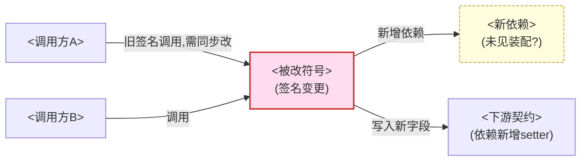

# 变更阅读报告模板与格式规范

> 本文件供 `code-read-deep-change` 在「阶段 8：报告生成」时对照使用。
> 报告必须是**一次变更**（git diff / git show / commit 范围 A..B / PR / `.diff` 文本）的阅读结果，固定 8 段、内含一张 Mermaid 图、中文输出。
> 定位是**理解变更**（改了什么 / 为什么 / 波及谁 / 有哪些风险点），**不是质量评判**（好不好 / 安不安全 / 该不该合 → `code-review-deep-zh`）。

---

## 一、格式规范（规范化自检依据）

1. **标题层级固定**
   - 一级标题 `#`：`# 变更阅读报告：<变更标识>`（变更标识如 `git diff`、`abc123`、`A..B`、`PR #42`、`sample.diff`）。
   - 二级标题 `##`：8 个固定段落，顺序不可调换。
2. **变更标识**：报告顶部标注变更来源、范围（涉及文件数 / 改动符号数）、涉及语言/模块、生成日期。
3. **位置引用**：一律 `相对路径:行号`，可点击，不写绝对路径；引用 diff 内改动点尽量带行号或 `@@` 锚点。
4. **一张图**：影响半径图，用 ```mermaid 围栏。
5. **风险显式**：行为变化、未同步的调用方/测试/文档、可能遗漏的受影响路径，必须在「风险面」摊开；这是本 skill 特有视角，但仍是**理解层面的风险提示**，不是质量评分。
6. **委派标注**：
   - 深挖某个**受影响调用方/受影响容器** → 附"读透此处 → `code-read-deep-{function/file/module/project}` <目标>"。
   - 想沿某条**受影响线索**追到底 → 附"追到底 → `code-read-deep-trace` <线索>"。
7. **问题分级**：🔴/🟡/🔵，每条带 `file:line` + 证据 + 影响（仅逻辑/流程硬伤 + 变更相关不一致，判定见 `problem-checklist.md`）。
8. **中文排版**；空段写「无」并一句话说明。

---

## 二、报告模板（复制后填充）

```markdown
# 变更阅读报告：<变更标识>

> 来源：<git diff / git show <sha> / A..B / PR #n / .diff 文本> ｜ 范围：<N> 文件 / <M> 处符号改动 ｜ 涉及：<语言/模块> ｜ 生成：<YYYY-MM-DD>

## 1. 变更范围
> 这次变更覆盖了哪些文件与符号。先 `--stat` 列文件，再落到符号级。

| 文件 | 改动类型 | 行数(±) | 涉及符号（类/方法/函数/字段） |
|------|---------|---------|------------------------------|
| `<相对路径>` | 新增/删除/修改 | +X / -Y | `<符号>`（签名变/返回变/删除/新增…） |

## 2. 改了什么
> 逐处描述**实质改动**（"这处把 X 改成 Y，效果是 Z"），不是逐行念 diff。
- `<file:line>` —— <把 X 改成 Y，效果是 Z>。
- `<file:line>` —— <新增了 …>。

## 3. 意图推断
> 结合 commit message / PR 描述 / 周边上下文 / git 历史推断"为什么这么改"。证据不足时标「推断」。
- **意图**：<这次变更想达到什么>。
- **证据来源**：<commit message / PR 描述 / 周边代码 / git 历史；用了哪个视角注明>。

## 4. 影响半径
> 对每个**被改的对外符号**（公共方法/导出函数/签名变了/返回语义变了/被删除/新增依赖），全库反查调用方与消费方。

| 被改符号 | 变化性质 | 受影响调用方/消费方 | 位置 | 是否需同步改 |
|---------|---------|--------------------|------|-------------|
| `<符号>` | 签名变/删除/新增依赖/契约变 | `<调用方>` | `<file:line>` | 需/否/未反查 |

**影响半径图**

> 中心 = 被改符号；四周 = 受影响的调用方/消费方/下游契约。在边或节点上标注「签名变更 / 已删除 / 新增依赖未装配」等。

## 5. 关联测试
> 被改代码有无对应测试？是否覆盖改动的新行为/边界？哪些测试需更新（"测试即规格"视角）。无则写「未发现关联测试」并说明影响。
- **现有测试**：`<file:line>` —— <覆盖了什么 / 是否覆盖本次新行为>。
- **需更新/缺失**：<哪些测试因签名或行为变化需改；哪些新行为无测试覆盖>。

## 6. 风险面
> 本 skill 特有视角：理解层面的风险提示（非质量评分）。
- **行为变化点**：<改动改变了什么可观察行为>。
- **边界/兼容性影响**：<对旧调用方/旧数据/序列化契约的影响>。
- **可能遗漏的受影响路径**：<diff 未包含但理应同步的调用点/装配/迁移>。
- **未同步更新**：<调用方 / 测试 / 文档 中疑似漏改的>。

## 7. 问题
> 仅逻辑/流程硬伤 + 变更相关不一致（判定见 problem-checklist.md）。无则写「未发现明显问题」。

### 🔴 阻断
- `<file:line>` —— <问题> ｜ 证据：<…> ｜ 影响：<…>
### 🟡 建议
- `<file:line>` —— <问题> ｜ 证据：<…> ｜ 影响：<…>
### 🔵 提示
- `<file:line>` —— <问题> ｜ 证据：<…> ｜ 影响：<…>

## 8. 建议下一步
- 深挖某个受影响调用方/容器 → `code-read-deep-function`（方法）/ `code-read-deep-file`（文件）/ `code-read-deep-module`（模块）/ `code-read-deep-project`（项目）。
- 沿某条受影响线索追到底 → `code-read-deep-trace` <线索>。
- 本报告剪枝/未反查边界：<列出未逐一反查的符号或路径>。
- 需要完整质量审查（好不好/安不安全/该不该合）→ `code-review-deep-zh`，不在本 skill 范围。
```

---

## 三、填充要点
- 「影响半径」是重心：每个对外/高风险符号都要反查调用方，并明确"是否需同步改"；反查不到或剪枝的要标「未逐一反查」。
- 影响半径图只画**一张**：中心被改符号，四周受影响方；用边/节点标注「签名变更 / 已删除 / 新增依赖未装配 / 依赖新增 setter」等。
- 「意图推断」证据不足就老实标「推断」，不要把猜测写成结论。
- 深挖某个受影响调用方/容器一律**向下委派**，沿线索追到底**委派给 trace**，不在本报告里展开某容器内部或把整条链追穿。
- 始终是**理解变更**，不是给变更打质量分；越界的质量/安全/性能判断一律导流 `code-review-deep-zh`。
- 报告完成后，逐项过「SKILL.md › 规范化自检」清单再交付。
