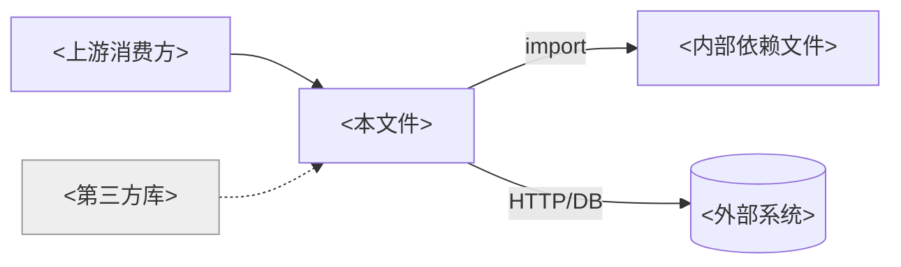

# 文件阅读报告模板与格式规范

> 本文件供 `code-read-deep-file` 在「阶段 7：报告生成」时对照使用。
> 报告必须是**单个源文件**的阅读结果，固定 9 段、内含两张 Mermaid 图（① 结构图、② 依赖关系图）、中文输出。

---

## 一、格式规范（规范化自检依据）

1. **标题层级固定**
   - 一级标题 `#`：报告标题，格式 `# 文件阅读报告：<文件名>`。
   - 二级标题 `##`：9 个固定段落，顺序不可调换。
   - 三级标题 `###`：段落内子项（如「问题」段按级别分组、「构成清单」按类分组）。
2. **文件标识**：报告顶部标注语言、文件 `相对路径`、总行数 LOC、所属包/命名空间、生成日期。
3. **代码位置引用**：一律用 `相对路径:行号`（如 `src/order/OrderService.java:42`），可点击。不要写绝对路径。
4. **代码片段**：用带语言标识的围栏（```java / ```python …）；只摘关键几行，禁止整段粘贴整个文件。
5. **两张图**：均用 ```mermaid 围栏。① 结构图 `classDiagram`（OO）或 `flowchart`（无类语言）；② 依赖关系图 `flowchart LR`。
6. **问题分级标记统一**：🔴 阻断 / 🟡 建议 / 🔵 提示。每条含 `file:line`、证据、一句话影响。
7. **剪枝/省略声明**：Outline 漏列、深读未展开、依赖未尽，必须注明「（已剪枝/未逐一展开）」，不要让读者误以为已穷尽。
8. **委派标注**：「重点方法选读」每个成员末尾附"完整调用链/数据流 → `code-read-deep-function` `类名.方法名`"。
9. **中文排版**：中英文之间留空格；术语全文统一；不堆砌套话。
10. **空段处理**：某段确无内容（如无外部依赖/无消费方），写「无」并一句话说明，不留空标题。

---

## 二、报告模板（复制后填充）

```markdown
# 文件阅读报告：<文件名>

> 语言：<Java/Python/...> ｜ 路径：`<相对路径>` ｜ 行数：<LOC> ｜ 包/命名空间：`<package>` ｜ 生成：<YYYY-MM-DD>

## 1. 定位
- **文件路径**：`<相对路径>`，共 <LOC> 行。
- **包/命名空间**：`<package>`。
- **系统角色**：属于 <Controller/Service/DAO/工具/配置/...> 层。
- **文件类型**：<实体/服务/控制器/工具/配置/测试/...>，含 <N> 个类、<M> 个顶层函数（按实际）。

## 2. 职责概述
- **一句话职责**：<这个文件整体上承担什么职责>。
- **是否单一职责**：<单一 / 混杂（如混杂，点出它同时承担了哪几件事——仅作提示，不做架构评审）>。
- **关键领域名词**：<涉及的领域对象/状态/术语，简列>。

## 3. 构成清单（Outline）
> 覆盖文件内**全部**顶层构件；每项一句话定位，不展开实现。可按类分组。

### <类名 A>（`<相对路径>:<行号>`）
| 构件 | kind | 可见性 | 位置 | 一句话定位 |
|------|------|--------|------|-----------|
| <方法名> | 方法 | public | `:行号` | <做什么> |
| <方法名> | 方法 | private | `:行号` | <做什么> |

### 顶层函数 / 常量（如有）
| 构件 | kind | 导出 | 位置 | 一句话定位 |
|------|------|------|------|-----------|
| <函数名> | 函数 | export | `:行号` | <做什么> |

## 4. 对外接口（Public API）
- **对外暴露（消费方契约）**：
  - `<导出/公共成员>`（`:行号`）—— <用途/契约>
- **内部 helper（不对外）**：
  - `<私有成员>`（`:行号`）—— <辅助谁>

## 5. 内部结构与协作

<一段话：文件内各构件如何协作，主干是哪条>

**① 结构图**
```mermaid
classDiagram
    class <类名> {
      +<公共方法>()
      -<私有helper>()
    }
    <类名> --> <协作类> : 持有/调用
    %% 无类语言可改用 flowchart：成员为节点，调用为边
    %% 未展开的部分请注释标明：%% trivial/第三方 已剪枝
```

## 6. 依赖与消费方

**① 上游（本文件依赖谁）**：
- `<依赖类/模块>`（`<相对路径>` 或「第三方」）—— <用途>
- 外部 IO：<DB/HTTP/MQ/缓存/文件 读写点；无则写「无」>

**② 下游（谁消费本文件）**：
- `<消费方类>.<方法>`（`<相对路径>:<行号>`）—— <调用场景>
- 框架入口：<路由/定时/监听，注明"由框架调用"；无则写「无」>

**② 依赖关系图**


## 7. 关键数据与状态
- **核心数据结构/类型**：<文件定义或围绕的核心类型，标 file:line>。
- **关键字段/模块级状态**：<重要字段、静态/全局状态、缓存；无则写「无」>。

## 8. 重点方法选读（1~3 个）
> 中等深度：职责 + 关键分支/状态 + 关键协作；完整链路委派方法级 skill。

### <类名>.<方法名>（`:行号`）
- **职责**：<做什么>。
- **关键分支/状态**：<重要 if/switch/循环/提前返回>。
- **关键协作**：<在文件内调了哪些 helper、触达哪些外部 IO>。
- **深挖**：完整调用链/数据流 → 用 `code-read-deep-function` 读 `<类名>.<方法名>`。

## 9. 问题
> 仅逻辑/流程硬伤。无问题则写「未发现明显逻辑/流程问题」。

### 🔴 阻断
- `<相对路径>:<行号>` —— <问题> ｜ 证据：<为什么是问题> ｜ 影响：<不修会怎样>

### 🟡 建议
- `<相对路径>:<行号>` —— <问题> ｜ 证据：<...> ｜ 影响：<...>

### 🔵 提示
- `<相对路径>:<行号>` —— <问题> ｜ 证据：<...> ｜ 影响：<...>

---

### 下一步 / 缩放建议
- 想深挖某个方法的完整调用链与数据流 → `code-read-deep-function` `<类名>.<方法名>`。
- 本报告剪枝/未展开边界：<列出>。
- 想读整个模块/目录的整体结构 → 不在本 skill 范围。
```

---

## 三、填充要点

- 「定位/职责概述」短小精炼；「构成清单/内部结构/依赖与消费方」是文件级报告的重心。
- **Outline 要全**：文件内每个类/顶层函数都要出现在清单里，但每项只给一句话——这是"地图"，不是"详图"。
- 结构图只放**剪枝后保留**的关键节点，别把 trivial 调用塞进去。
- 「重点方法选读」**最多 3 个**，每个必须带"深挖委派"标注；想看更多方法，引导用户对具体方法再跑方法级 skill。
- 「问题」段如果越界（写到了安全/性能/风格），删掉它——那是 `code-review-deep-zh` 的范围。
- 报告完成后，逐项过「SKILL.md › 规范化自检」清单再交付。
