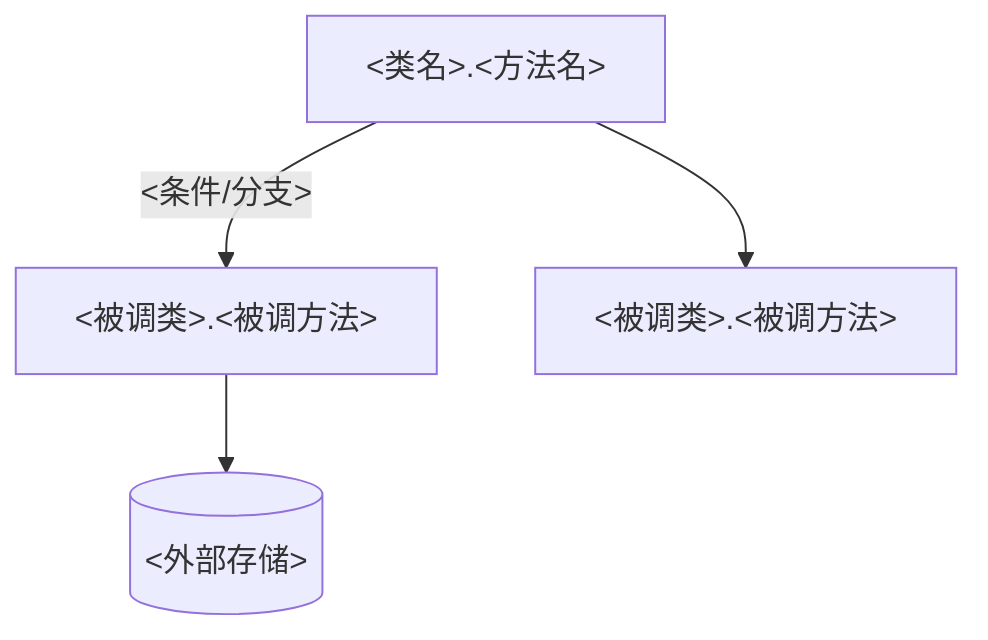
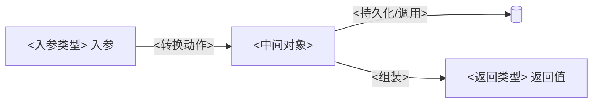
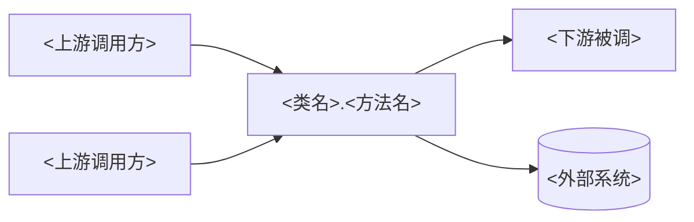

# 阅读报告模板与格式规范

> 本文件供 `code-read-deep-function` 在「阶段 6：报告生成」时对照使用。
> 报告必须是单个方法入口的阅读结果，固定 8 段、内含两张 Mermaid 图、中文输出。

---

## 一、格式规范（规范化自检依据）

1. **标题层级固定**
   - 一级标题 `#`：报告标题，格式 `# 代码阅读报告：<类名>.<方法名>`。
   - 二级标题 `##`：8 个固定段落，顺序不可调换。
   - 三级标题 `###`：段落内子项（如「问题」段按级别分组）。
2. **入口标识**：报告顶部标注语言、入口 `file:line`、完整签名、生成日期。
3. **代码位置引用**：一律用 `相对路径:行号` 形式（如 `src/order/OrderService.java:42`），可点击。不要写绝对路径。
4. **代码片段**：用带语言标识的围栏（```java / ```python …）；只摘录关键几行，禁止整段粘贴。
5. **两张图**：均用 ```mermaid 围栏。① 逻辑调用图 `flowchart TD`；② 数据流转图 `flowchart LR`。
6. **问题分级标记统一**：🔴 阻断 / 🟡 建议 / 🔵 提示。每条含 `file:line`、证据、一句话影响。
7. **剪枝声明**：凡是因深度/第三方/trivial 而未展开的分支，必须在「流程」或「上下游」里注明「（已剪枝，未展开）」，不要让读者误以为链路到此为止。
8. **中文排版**：中英文之间留空格；术语全文统一；不堆砌套话。
9. **空段处理**：某段确无内容（如该方法无外部 IO），写「无」并一句话说明，不留空标题。

---

## 二、报告模板（复制后填充）

```markdown
# 代码阅读报告：<类名>.<方法名>

> 语言：<Java/Python/...> ｜ 入口：`<相对路径>:<行号>` ｜ 签名：`<完整方法签名>` ｜ 生成：<YYYY-MM-DD>

## 1. 定位
- **所在位置**：`<相对路径>:<行号>`，包/命名空间 `<package>`，类 `<类名>`。
- **签名**：`<返回值 方法名(参数列表)>`，可见性/修饰符 `<public/static/...>`。
- **系统角色**：属于 <Controller/Service/DAO/工具/...> 层，承担 <一句话定位>。
- **消歧说明**：<若存在重载或同名类，说明本次锁定的是哪一个；否则写「唯一命中」>。

## 2. 概念
- **业务/领域含义**：<这个方法在业务上做什么>。
- **一句话职责**：<用一句话概括它的单一职责>。
- **关键领域名词**：<涉及的领域对象/状态/术语，简列>。

## 3. 流程
<按步骤编号描述执行流；每步点出关键调用与分支>
1. <步骤1：做了什么 → 调用了谁>
2. <步骤2：判断了什么 → 走哪条分支>
3. ...

**① 逻辑调用图**


## 4. 算法
- **核心逻辑**：<这个方法的核心算法/计算/编排是什么>。
- **关键分支与状态**：<重要的 if/switch/循环、状态流转、提前返回>。
- **前置/后置条件**：<进入前要满足什么、返回后保证什么>。
- **复杂度（如适用）**：<时间/空间，或「无显著复杂度」>。

## 5. 数据流转
<描述数据如何从入参流到返回值，经过哪些转换与外部读写>

**② 数据流转图**


- **入参 → 返回值**：<主链路上的数据变形>。
- **跨层转换**：<DTO→领域对象→实体 等转换点，标 file:line>。
- **外部 IO**：<DB/HTTP/MQ/缓存/文件 读写点；无则写「无」>。

## 6. 代码摘录
> 只摘关键片段，每段配一句话说明它为何关键。

- `<相对路径>:<行号>` —— <这段在做什么/为何关键>
  ```<lang>
  <关键几行>
  ```

## 7. 问题
> 仅逻辑/流程硬伤。无问题则写「未发现明显逻辑/流程问题」。

### 🔴 阻断
- `<相对路径>:<行号>` —— <问题> ｜ 证据：<为什么是问题> ｜ 影响：<不修会怎样>

### 🟡 建议
- `<相对路径>:<行号>` —— <问题> ｜ 证据：<...> ｜ 影响：<...>

### 🔵 提示
- `<相对路径>:<行号>` —— <问题> ｜ 证据：<...> ｜ 影响：<...>

## 8. 上下游消费方
- **上游（谁调用此入口）**：
  - `<调用方类>.<方法>`（`<相对路径>:<行号>`）—— <调用场景>
- **下游（此入口调用/依赖谁）**：
  - `<被调类>.<方法>` / 外部系统 `<DB/HTTP/MQ>` —— <用途>

**上下游关系图**

```

---

## 三、填充要点

- 「定位/概念」短小精炼，各几行即可；「流程/算法/数据流转」是重心。
- 调用图节点只放**经过剪枝后保留**的关键节点，别把 trivial 调用塞进去。
- 「问题」段如果越界（写到了安全/性能/风格），删掉它——那是 `code-review-deep-zh` 的范围。
- 报告完成后，逐项过「SKILL.md › 规范化自检」清单再交付。
