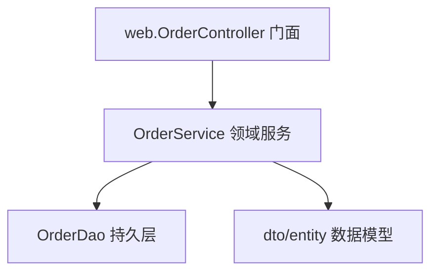
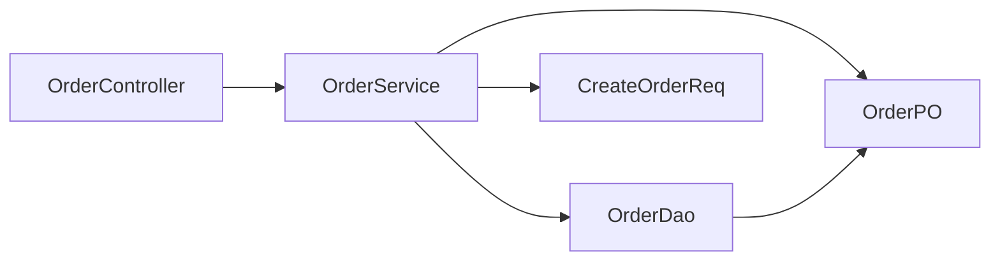
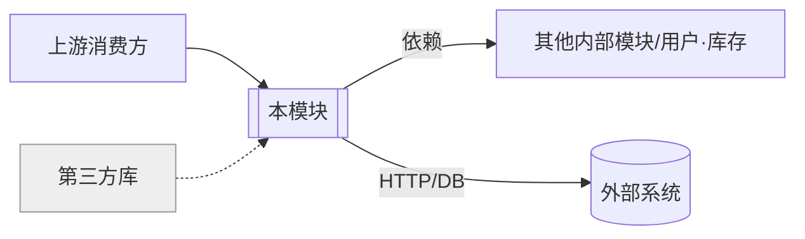

# 模块阅读报告模板与格式规范

> 本文件供 `code-read-deep-module` 在「阶段 7：报告生成」时对照使用。
> 报告必须是**单个模块（目录/包子树）**的阅读结果，固定 10 段、内含三张 Mermaid 图、中文输出。

---

## 一、格式规范（规范化自检依据）

1. **标题层级固定**
   - 一级标题 `#`：报告标题，格式 `# 模块阅读报告：<模块名/路径>`。
   - 二级标题 `##`：10 个固定段落，顺序不可调换。
   - 三级标题 `###`：段落内子项（如分层、问题分级）。
2. **模块标识**：报告顶部标注语言/技术栈、模块根路径、规模（文件数/总 LOC/子包数）、生成日期。
3. **位置引用**：一律用 `相对路径:行号` 或 `相对路径`（文件粒度），不写绝对路径。
4. **三张图**：均用 ```mermaid 围栏。① 组件/分层结构图；② 内部依赖图（环/分层破坏标注）；③ 上下文/依赖关系图。
5. **问题分级标记统一**：🔴 阻断 / 🟡 建议 / 🔵 提示。每条含位置、证据、一句话影响。
6. **剪枝/省略声明**：文件清单未逐一、路径未走全、依赖未尽，必须注明「（未逐一展开/已剪枝）」。
7. **委派标注**：「入口与关键路径选读」每条路径附"读整个文件 → `code-read-deep-file`；深挖某方法 → `code-read-deep-function`"。
8. **中文排版**：中英文之间留空格；术语全文统一；不堆砌套话。
9. **空段处理**：某段确无内容（如无外部依赖/无消费方），写「无」并一句话说明。

---

## 二、报告模板（复制后填充）

```markdown
# 模块阅读报告：<模块名/路径>

> 语言/技术栈：<Java + Spring / Python ...> ｜ 模块根：`<相对路径>` ｜ 规模：<N 文件 / M 行 / K 子包> ｜ 生成：<YYYY-MM-DD>

## 1. 定位
- **模块根**：`<相对路径>`，<N> 个文件 / <M> 行 / <K> 个子包。
- **语言/构建**：<语言 + 构建系统（Maven/Gradle/pyproject/...）>。
- **系统角色**：在整体架构中属于 <C4 Container/Component 中的什么>，承担 <一句话定位>。

## 2. 职责概述
- **一句话职责**：<这个模块整体上负责什么>。
- **边界**：<它负责什么、明确不负责什么>。
- **是否单一职责/限界上下文**：<聚焦 / 混杂（混杂则点出承担了哪几件事，仅提示不做架构评审）>。

## 3. 结构总览（文件与子包清单）
> 模块"地图"：目录树 + 关键文件/子包一句话定位，不展开文件内部。

```
<模块根>/
├── web/OrderController.java   —— 对外 HTTP 门面（入口）
├── OrderService.java          —— 领域服务，下单主流程编排
├── OrderDao.java              —— 持久层（DB 写）
├── dto/CreateOrderReq.java    —— 下单请求 DTO
└── entity/OrderPO.java        —— 订单实体（核心数据模型）
```

## 4. 对外门面（Public API / Facade）
- **对外暴露（消费方契约）**：
  - `<导出门面/服务/端点>`（`<相对路径>:<行号>`）—— <契约/用途>
- **仅模块内可见**：<不对外的内部类/函数，简列>

## 5. 内部分层与组件协作

<一段话：模块内分了哪几层/几个组件，主干是哪条>

**① 组件/分层结构图**


## 6. 内部依赖与依赖健康
<描述模块内文件/子包间依赖；是否有环、分层是否被破坏>
- **依赖环**：<有则列出环路；无则写「无环（满足 ADP）」>。
- **分层破坏**：<有则列出反向依赖；无则写「无」>。
- **稳定核心 / 易变边缘**（可选）：<被依赖最多的核心文件>。

**② 内部依赖图**


## 7. 外部依赖与消费方
- **外部依赖（上游，模块子树之外）**：
  - `<内部模块/第三方>`（`<路径>` 或「第三方」）—— <用途>
  - 外部 IO：<DB/HTTP/MQ/缓存/文件；无则写「无」>
- **消费方（下游）**：
  - `<消费方>`（`<路径>:<行号>`）—— <调用场景>
  - 框架入口：<路由/定时/监听；无则写「无」>

**③ 上下文/依赖关系图**


## 8. 关键抽象与数据模型
- **核心数据模型/实体**：<模块的核心类型/实体/状态机，标 file:line>。
- **关键抽象**：<门面/核心服务/接口及其语义>。

## 9. 入口与关键路径选读（1~3 条）
> 中等深度的端到端走读：路径经过哪几层、触达哪些外部 IO；完整逻辑委派下层 skill。

### 路径 1：<入口> → ... → <出口>
- **触发**：<谁/什么触发此路径>。
- **流经**：<门面 → 服务 → 持久层 → 外部 IO，各一句话>。
- **深挖**：读整个文件 → `code-read-deep-file <文件路径>`；深挖某方法 → `code-read-deep-function <类名.方法名>`。

## 10. 问题
> 逻辑/流程硬伤 + 模块级结构硬伤（依赖环/分层破坏）。无则写「未发现明显问题」。

### 🔴 阻断
- `<相对路径>:<行号>` —— <问题> ｜ 证据：<...> ｜ 影响：<...>

### 🟡 建议
- `<相对路径>:<行号>` —— <问题> ｜ 证据：<...> ｜ 影响：<...>

### 🔵 提示
- `<相对路径>` —— <模块级结构提示，如依赖环/分层破坏> ｜ 证据：<...> ｜ 影响：<...>

---

### 下一步 / 缩放建议
- 想读模块里某个**文件**整体 → `code-read-deep-file <文件路径>`。
- 想深挖某个**方法**完整调用链/数据流 → `code-read-deep-function <类名.方法名>`。
- 本报告剪枝/未展开边界：<列出>。
- 需要完整的安全/性能/规范多维度审查 → `code-review-deep-zh`，不在本 skill 范围。
```

---

## 三、填充要点

- 「定位/职责概述」短小精炼；「结构总览 / 内部依赖 / 外部依赖与消费方」是模块级报告的重心。
- **结构总览要覆盖全模块**关键文件/子包，但每项一句话——这是"地图"。
- 三张图各司其职：① 看分层协作、② 看内部依赖健康（环/破坏）、③ 看模块对外上下文，别混为一张。
- 「入口与关键路径选读」**最多 3 条路径**，每条必带"向下委派"标注，绝不逐文件/逐方法深挖。
- 「问题」段越界（写到安全/性能/风格全维度）即删——那是 `code-review-deep-zh` 的范围；模块级只保留逻辑硬伤 + 明显的依赖环/分层破坏。
- 报告完成后，逐项过「SKILL.md › 规范化自检」清单再交付。
