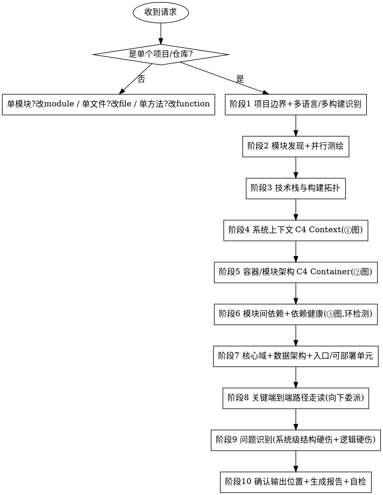
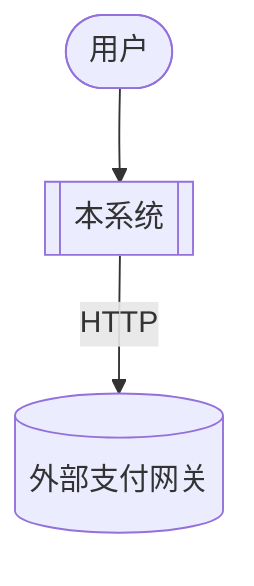
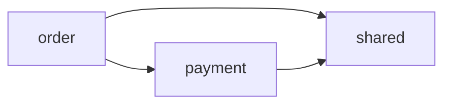

# 深度代码阅读 · 项目级 (code-read-deep-project)

从用户明确给出的**单个项目/仓库（含多模块、可多语言）**出发，**只读不改**地把整个项目读透：
识别项目边界与技术栈 → 发现并（必要时并行）测绘所有模块/服务 → 理技术栈与构建拓扑 →
画系统上下文（C4 Context）与容器架构（C4 Container）→ 画模块间依赖图并做健康体检 →
从入口选择性走读 1~3 条跨模块关键路径 → 顺手记录系统级结构硬伤，
最后产出一份**结构化、规范化**的中文阅读报告，内含三张 **Mermaid** 图。

报告遵循固定的 11 段结构：**定位 → 系统职责概述 → 模块/服务总览 → 技术栈与构建拓扑 → 系统上下文 → 容器/模块架构 → 模块间依赖与依赖健康 → 核心域与数据架构 → 入口与可部署单元 → 关键端到端路径走读 → 问题**。

> 与 `code-read-deep-module`（模块级）、`code-read-deep-file`（文件级）、`code-read-deep-function`（方法级）是**同一家族**，形成 **项目 → 模块 → 文件 → 方法** 四级缩放：
> 本 skill 给"系统全景 + 三张 C4/依赖图 + 跨模块路径走读"，想下钻到模块/文件/方法分别改用对应 skill。

---

## 核心定位

- **项目驱动**：分析对象永远是"一个项目/仓库（含多模块）"，不是一个模块、一个文件、一个方法。
- **地图优先 + 并行测绘，不逐模块深挖**：先发现全部模块、（必要时派子代理并行）测绘成系统地图，再选择性走读 1~3 条跨模块路径；下钻向下委派。
- **系统全景是重心**：项目级阅读的核心是 **C4 Context/Container + 模块间依赖（含环检测）+ 技术栈/构建拓扑**（业内 C4、4+1、架构重建、包原则）。
- **只读不改**：全程不编辑任何业务代码，只产出报告（符合仓库与全局规则）。
- **阅读导向，不是质量审查**：问题部分只报系统级结构硬伤（模块环/分 tier 破坏/绕过门面/构建-运行期不一致/跨模块契约误用）+ 顺带逻辑硬伤，不做安全/性能/规范/架构取舍的全维度审查（那是 `code-review-deep-zh`）。
- **多语言 / polyglot**：逐生态识别语言与构建系统，支持一个项目内多语言并存（如 Java 后端 + TS 前端）。

---

## 硬性前置：必须是「一个项目/仓库」

> 这是本 skill 能否启动的闸门，先判定，再做其他任何事。

**只接受单个项目/仓库根。** 输入形态：仓库根/项目根目录（含构建清单如 `settings.gradle`/`package.json`/`go.work`/`*.sln`，或多个模块子目录）。

以下输入**不走本 skill**：

- 给了**单个模块/目录/包** → 用 `code-read-deep-module`。
- 给了**单个文件** → 用 `code-read-deep-file`。
- 给了**单个方法入口 `类名.方法名`** → 用 `code-read-deep-function`。
  - 标准回应（按粒度择一）：
    > 你给的是单个 <模块/文件/方法>，请用 `code-read-deep-<module/file/function>`。若想通读整个项目，请给我项目/仓库根目录。
- **超大 monorepo 含多个相互独立的产品** → 先做顶层 landscape 测绘，再请用户聚焦其中一个产品/子树。

> 项目边界不清（多个独立产品共处一仓）时，**先列顶层结构、请用户确认聚焦范围**，不擅自全读到失焦。

---

## 何时使用 / 何时不用

**使用本 skill：**
- 用户给出了**单个项目/仓库**，想读懂/梳理整个项目或代码库。
- 用户想要**系统架构图（C4）/ 模块依赖图 / 技术栈全景**。
- 用户想知道项目**由哪些模块/服务组成**及其依赖关系（要一张系统地图）。
- 用户想知道系统**对外依赖哪些外部系统**、模块间**依赖有没有环**。
- 用户要一份**项目导览**（新人 onboarding）。

**不要用本 skill（改走对应能力）：**
- 给的是单个模块/目录/包 → `code-read-deep-module`。
- 给的是单个文件 → `code-read-deep-file`。
- 给的是单个方法入口 `类名.方法名` → `code-read-deep-function`。
- 代码质量审查、安全审计、性能审查、架构评审、合并前审查 → `code-review-deep-zh`。
- 只是给代码加注释 → `code-annotating`。
- 只要一句话解释一小段代码 → `/explain` 命令。
- 调试排查具体 bug → systematic-debugging。
- 编写新功能/新代码 → code-vibe-workflow。

---

## 工作流程

按顺序执行，不要跳阶段。详细规则按需加载对应 `references/` 文件。
> 必要时加载 `references/reading-lenses.md`——测试即规格 / git 历史 / 运行期证据 / 框架感知 四个补充阅读视角；用了哪个就在报告相应段落注明证据来源。



### 阶段 1：项目边界判定 + 多语言/多构建识别
1. **闸门检查**：确认输入是项目/仓库；单模块/单文件/单方法分别改道 module/file/function skill。
2. **识别技术栈与构建系统**：扫描根与子目录的构建/清单文件（`settings.gradle`/`pom.xml`/`package.json`/`go.work`/`*.sln`…），逐生态识别（支持 polyglot）。
3. **解析边界**：超大 monorepo 含多独立产品先列顶层结构、请用户聚焦。先读 README/架构文档。
4. 详见 `references/project-mapping-rules.md`（项目边界 + 多语言/多构建识别）。

### 阶段 2：模块/服务发现 + 并行测绘 —— 规模应对核心
1. 据 README/构建清单 + Glob 发现顶层模块/服务/可部署单元。
2. **模块多时为每个模块派 Explore/子代理并行测绘**（各出"职责 + 门面 + 关键依赖"摘要），主代理汇总；模块少（≤3~4）则顺序测绘。
3. 每个模块**止于摘要级**；要读透某模块 → 委派 `code-read-deep-module`。
4. 详见 `references/project-mapping-rules.md`（模块发现 + 并行测绘）。

### 阶段 3：技术栈与构建拓扑
理出语言分布、主要框架/中间件、构建工具，以及**构建依赖图**（区分构建期依赖 vs 运行期调用）。

### 阶段 4：系统上下文（→ ① C4 Context 图）
C4 L1：系统当一个盒子，画使用者/角色 + 外部系统（第三方/外部服务）及关键交互。产出 → ① 系统上下文图。

### 阶段 5：容器/模块架构（→ ② C4 Container 图）
C4 L2：拆出可部署/可运行单元（前端/API/服务/DB/MQ…），标技术栈与运行期通信（HTTP/RPC/MQ）。产出 → ② 容器/模块架构图。

### 阶段 6：模块间依赖图 + 依赖健康（→ ③ 模块依赖图）
汇总各模块依赖建模块→模块有向图；**依赖健康体检**：模块间环检测（ADP）、分 tier/分层破坏、稳定核心识别。
- 详见 `references/project-mapping-rules.md`（模块间依赖图 + 依赖健康）。
- 产出 → ③ 模块间依赖图（环/破坏特殊标注）。

### 阶段 7：核心域 + 数据架构 + 入口/可部署单元
识别限界上下文/业务域、主要数据存储与跨模块共享数据模型、系统入口与可部署单元清单。

### 阶段 8：关键端到端路径走读（1~3 条跨模块，向下委派）
从入口挑 **1~3 条最关键的跨模块端到端业务流**中等深度走读（流经哪些模块/入口与外部 IO）。
- **止于跨模块路径级**：不展开任一模块/文件/方法内部。每条路径附四级委派（module/file/function）。
- 详见 `references/project-mapping-rules.md`（关键端到端路径走读）。

### 阶段 9：问题识别（系统级结构硬伤 + 逻辑硬伤）
顺手记录**明显**问题，分三级（🔴/🟡/🔵），每条带位置 + 证据 + 一句话影响。
- 范围：系统级结构硬伤（模块间环、跨模块分 tier 破坏、绕过门面、构建-运行期依赖不一致、跨模块契约误用）**＋** 顺带可见的逻辑硬伤。
- **不**做安全/性能/规范/架构取舍的全维度审查——那是 `code-review-deep-zh`。
- 判定清单见 `references/problem-checklist.md`。

### 阶段 10：报告生成（输出位置由用户指定 + 规范化自检）
1. **先确认输出位置与文件名**——由用户指定，不自作主张：
   - 询问报告写到哪个目录、用什么文件名；
   - 用户未指定时，给出**建议默认**（如 `docs/code-read-deep-project/<项目名>-YYYYMMDD.md`）并请其确认；
   - 用户也可选择**仅在对话中输出、不落文件**。
2. 按 `references/report-template.md` 的 11 段结构 + 格式规范生成 Markdown（含三张 Mermaid 图）。
3. **规范化自检**（见下）后再交付/写文件。

---

## 报告结构（11 段）

完整模板与格式规范见 `references/report-template.md`。十一段固定顺序：

1. **定位** —— 项目根、仓库类型、技术栈、规模（模块数/文件数/LOC/语言分布）、构建系统。
2. **系统职责概述** —— 系统是什么、核心业务能力、架构风格。
3. **模块/服务总览** —— 列全顶层模块/服务/可部署单元，每个一句话职责（系统地图）。
4. **技术栈与构建拓扑** —— 语言/框架/中间件清单 + 构建依赖图（构建期 vs 运行期）。
5. **系统上下文** —— 内嵌 **① C4 Context 图**。
6. **容器/模块架构** —— 内嵌 **② C4 Container 图**。
7. **模块间依赖与依赖健康** —— 内嵌 **③ 模块依赖图**；环检测/分 tier 破坏结论。
8. **核心域与数据架构** —— 限界上下文/业务域、数据存储与共享数据模型。
9. **入口与可部署单元** —— 对外入口、可部署单元清单。
10. **关键端到端路径走读** —— 1~3 条跨模块路径中等深度走读，每条附四级向下委派。
11. **问题** —— 系统级结构硬伤 + 逻辑硬伤（分级 + 位置 + 证据 + 影响）。

---

## 三张 Mermaid 图的写法约定

> 全部用 Mermaid 代码块（```mermaid），保证可在 Markdown/GitHub/IDE 直接渲染。三张图各司其职，别混为一张。

**① 系统上下文图（C4 Context）**：用 `flowchart TD`。系统当一个盒子 + 用户/角色 + 外部系统。



**② 容器/模块架构图（C4 Container）**：用 `flowchart LR`。可部署/可运行单元 + 运行期通信。


**③ 模块间依赖图**：用 `flowchart LR`。模块→模块依赖（构建/运行期），环与分 tier 破坏特殊标注。



---

## 规范化自检（交付前必过）

生成报告后，对照以下清单逐项确认，不达标就修正：

- [ ] 11 段标题齐全、顺序正确、层级一致（`##` 段标题、`###` 子项）。
- [ ] 三张 Mermaid 图均存在且语法可渲染，各司其职（① 对外上下文 / ② 容器通信 / ③ 模块依赖）不重复。
- [ ] 「模块/服务总览」**覆盖项目内全部顶层模块/服务**，无遗漏（漏列要声明）。
- [ ] 「技术栈与构建拓扑」区分了**构建期依赖**与**运行期调用**。
- [ ] 「模块间依赖与依赖健康」给出**模块间环检测结论**（有环列出 / 无环写明）与分 tier 破坏结论。
- [ ] 「关键端到端路径走读」**不超过 3 条**，每条都附四级向下委派（module/file/function）。
- [ ] 问题分级用统一标记（🔴/🟡/🔵），每条含证据 + 影响；聚焦系统级结构硬伤 + 逻辑硬伤。
- [ ] 报告聚焦于**这一个项目**，未退化成逐模块/逐文件/逐方法深挖；并行测绘的摘要化损失已声明。
- [ ] 中文表述，术语前后一致；剪枝/省略处已注明边界。

---

## 与其他能力的边界（避免重叠）

| 能力 | 它做什么 | 与本 skill 的区别 |
|------|---------|------------------|
| `code-read-deep-module`（skill） | 读单个模块，给模块地图 | 本 skill 读**整个项目**，单模块下钻委派给它 |
| `code-read-deep-file`（skill） | 读单个文件 | 本 skill 读整个项目，单文件下钻委派给它 |
| `code-read-deep-function`（skill） | 从单方法入口深挖调用链/数据流 | 本 skill 给系统全景，单方法下钻委派给它 |
| `/explain`（命令） | 纯文本解释一小段代码 | 本 skill 出三张 C4/依赖图、列模块清单、结构化报告 |
| `code-annotating` | 给代码加注释（会改文件） | 本 skill 不改码、产报告 |
| `code-review-deep-zh` | 10 维度深度质量审查 | 本 skill 是阅读理解、不做架构取舍等全维度审查 |

---

## 增量更新与阅读索引（可选）

- **增量更新**：若用户指定的输出位置已存在上一版报告，先读旧报告、对比当前代码变化做**增量更新**（显式标注「新增 / 变化 / 移除」），而非从零重写。
- **阅读索引**：可在 `docs/code-read-deep/INDEX.md` 累积「已读清单」（粒度 ｜ 对象 ｜ 报告路径 ｜ 日期），让重复阅读沉淀为项目知识；首次写入时创建该文件。

---

## 常见错误

- **越界粒度误吃**：用户给的是单模块/单文件/单方法还硬当项目读 —— 错。分别改道 module/file/function skill。
- **失焦全读**：超大 monorepo 多个独立产品一锅端读到上下文爆炸 —— 错。先列顶层、请用户聚焦。
- **退化成逐模块/逐文件深挖**：对每个模块都跑一遍 module skill、每个文件都读透 —— 错。只走读 1~3 条跨模块路径，其余进清单/并行摘要，下钻向下委派。
- **不并行硬扛规模**：模块很多还在单上下文里顺序啃到超载 —— 错。模块多就派子代理并行测绘。
- **模块总览漏列**：只列"主模块"、漏掉公共库/前端/基础设施模块 —— 错。清单覆盖全项目顶层模块。
- **漏做依赖健康**：只画依赖图却不下模块间环检测/分 tier 破坏结论 —— 错。这是项目级阅读的结构重心。
- **混淆构建期与运行期**：把构建依赖与运行期 HTTP/RPC 调用混为一谈 —— 错。两者都画但标清。
- **越权改码 / 越界报问题 / 自作主张存盘**：同家族其他 skill —— 错。只读不改；只报结构+逻辑硬伤；输出位置由用户定。
