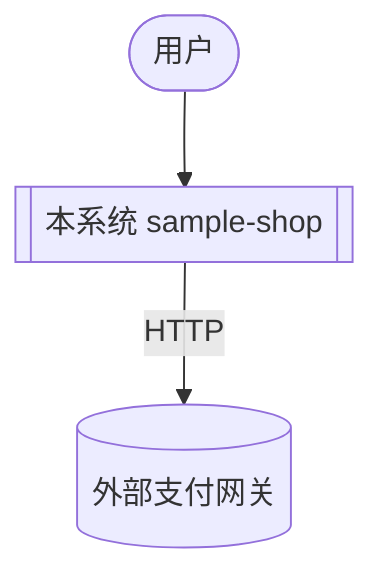
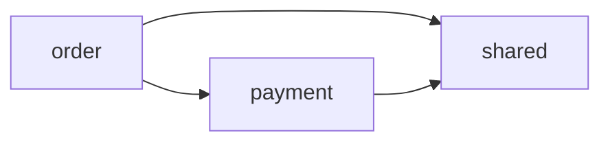

# 项目阅读报告模板与格式规范

> 本文件供 `code-read-deep-project` 在「阶段 10：报告生成」时对照使用。
> 报告必须是**单个项目/仓库（含多模块）**的阅读结果，固定 11 段、内含三张 Mermaid 图、中文输出。

---

## 一、格式规范（规范化自检依据）

1. **标题层级固定**
   - 一级标题 `#`：报告标题，格式 `# 项目阅读报告：<项目名>`。
   - 二级标题 `##`：11 个固定段落，顺序不可调换。
   - 三级标题 `###`：段落内子项。
2. **项目标识**：报告顶部标注技术栈、项目根路径、规模（模块数/文件数/总 LOC/语言分布）、生成日期。
3. **位置引用**：用 `相对路径`（模块/文件粒度），不写绝对路径。
4. **三张图**：均用 ```mermaid 围栏。① 系统上下文（C4 Context）；② 容器/模块架构（C4 Container）；③ 模块间依赖图（环/破坏标注）。
5. **问题分级标记统一**：🔴 阻断 / 🟡 建议 / 🔵 提示。每条含位置、证据、一句话影响。
6. **剪枝/省略声明**：模块清单未逐一、路径未走全、并行测绘有摘要化损失，必须注明。
7. **委派标注**：「关键端到端路径走读」每条路径附"读某模块 → `code-read-deep-module`；某文件 → `code-read-deep-file`；某方法 → `code-read-deep-function`"。
8. **构建期 vs 运行期**：依赖图/拓扑须标清是构建依赖还是运行期调用。
9. **中文排版**：中英文之间留空格；术语全文统一。
10. **空段处理**：某段确无内容（如无外部系统），写「无」并一句话说明。

---

## 二、报告模板（复制后填充）

```markdown
# 项目阅读报告：<项目名>

> 技术栈：<Java+Gradle / TypeScript ...> ｜ 项目根：`<相对路径>` ｜ 规模：<N 模块 / M 文件 / L 行 / 语言分布> ｜ 生成：<YYYY-MM-DD>

## 1. 定位
- **项目根**：`<相对路径>`，仓库类型 <单体 / 多模块 / monorepo / polyglot>。
- **规模**：<N> 个模块 / <M> 个文件 / 约 <L> 行；语言分布 <Java x% / TS y% ...>。
- **构建系统**：<Gradle 多模块 / Maven / npm workspaces / go.work ...>。

## 2. 系统职责概述
- **系统是什么**：<整个系统解决什么问题、提供什么核心业务能力>。
- **核心业务能力**：<一句话列主要能力>。
- **架构风格**（如可判定）：<单体 / 模块化单体 / 微服务 / 前后端分离 ...>。

## 3. 模块/服务总览（清单）
> 项目"地图"：列全顶层模块/服务/可部署单元，每个一句话职责。

| 模块/服务 | 语言/类型 | 路径 | 一句话职责 |
|-----------|----------|------|-----------|
| <shared> | Java/公共库 | `shared/` | <被复用的公共能力> |
| <payment> | Java/业务模块 | `payment/` | <...> |
| <order> | Java/业务模块 | `order/` | <对外 HTTP 入口...> |
| <web> | TS/前端 | `web/` | <...> |

## 4. 技术栈与构建拓扑
- **技术栈**：<语言、Web 框架、ORM、消息/缓存、构建工具、测试框架>。
- **构建拓扑（构建期依赖）**：<哪个模块 build 依赖哪个；区别于运行期调用>。

## 5. 系统上下文（C4 Context）
<一段话：系统边界、谁在用、依赖哪些外部系统>

**① 系统上下文图**


## 6. 容器/模块架构（C4 Container）
<一段话：系统拆成哪些可部署/可运行单元，怎么通信>

**② 容器/模块架构图**


## 7. 模块间依赖与依赖健康
<描述模块间依赖；是否有环、分 tier 是否被破坏>
- **模块间依赖环**：<有则列出环路；无则写「无环（满足 ADP）」>。
- **分 tier / 分层破坏**：<有则列出；无则写「无，依赖方向单向」>。
- **稳定核心 / 易变边缘**：<被依赖最多的模块（如 shared）>。

**③ 模块间依赖图**


## 8. 核心域与数据架构
- **核心域 / 限界上下文**：<order 域、payment 域…，各域核心职责与归属模块>。
- **数据架构**：<主要数据存储 DB/缓存/MQ；跨模块共享的核心数据模型，如 shared.Money>。

## 9. 入口与可部署单元
- **对外入口**：<前端、对外 API/Controller、main、定时任务、MQ 消费者 —— 标 file/路径>。
- **可部署单元**：<前端应用、后端服务… 及其部署形态>。

## 10. 关键端到端路径走读（1~3 条）
> 跨模块端到端业务流，中等深度；完整内部逻辑委派下层 skill。

### 路径 1：<入口> → ... → <出口>（跨 <模块A> → <模块B> → <模块C>）
- **触发**：<谁/什么触发>。
- **流经**：<前端 → order 入口 → payment 扣款 → shared，各一句话；点出外部 IO>。
- **深挖**：读某模块 → `code-read-deep-module <模块>`；某文件 → `code-read-deep-file <文件>`；某方法 → `code-read-deep-function <类名.方法名>`。

## 11. 问题
> 系统级结构硬伤（模块间环/分 tier 破坏/绕过门面/构建-运行期不一致/跨模块契约误用）+ 顺带可见的逻辑硬伤。无则写「未发现明显问题」。

### 🔴 阻断
- `<路径/位置>` —— <问题> ｜ 证据：<...> ｜ 影响：<...>

### 🟡 建议
- `<路径/位置>` —— <问题> ｜ 证据：<...> ｜ 影响：<...>

### 🔵 提示
- `<模块/路径>` —— <系统级结构提示> ｜ 证据：<...> ｜ 影响：<...>

---

### 下一步 / 缩放建议
- 想读某个**模块** → `code-read-deep-module <模块目录>`；某**文件** → `code-read-deep-file <文件>`；某**方法** → `code-read-deep-function <类名.方法名>`。
- 本报告剪枝/未展开边界：<并行测绘的摘要化损失、未走全的路径、未逐一的模块>。
- 需要完整的安全/性能/规范多维度审查 → `code-review-deep-zh`，不在本 skill 范围。
```

---

## 三、填充要点

- 「定位/系统职责」短小精炼；「模块总览 / 技术栈与构建拓扑 / 三张 C4 图 / 模块间依赖」是项目级报告的重心。
- **模块总览要覆盖全项目**顶层模块/服务，但每个一句话——这是"地图"。
- 三张图各司其职：① 系统对外（用户+外部系统）、② 可部署单元与运行期通信、③ 模块间构建/调用依赖与健康，别混为一张。
- 「关键端到端路径走读」**最多 3 条**，每条必带四级向下委派，绝不逐模块/逐文件/逐方法深挖。
- 「问题」段聚焦**系统级结构硬伤**（模块环/分 tier 破坏/绕过门面/构建-运行期不一致/跨模块契约误用）；架构好坏评判与重构建议交 `code-review-deep-zh`。
- 报告完成后，逐项过「SKILL.md › 规范化自检」清单再交付。
