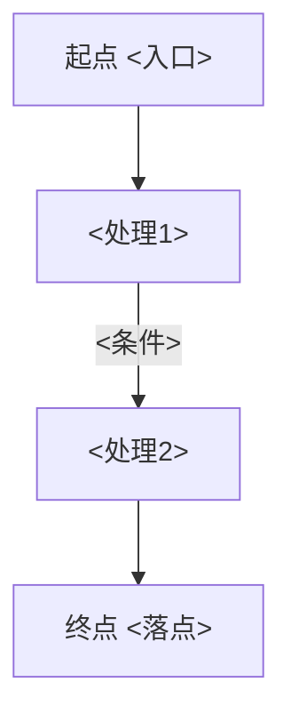

# 追踪阅读报告模板与格式规范

> 本文件供 `code-read-deep-trace` 在「阶段 8：报告生成」时对照使用。
> 报告必须是**一条横切线索**（业务能力/关注点/数据项）的追踪结果，固定 8 段、内含两张 Mermaid 图、中文输出。

---

## 一、格式规范（规范化自检依据）

1. **标题层级固定**
   - 一级标题 `#`：`# 追踪阅读报告：<追踪目标>`。
   - 二级标题 `##`：8 个固定段落，顺序不可调换。
2. **追踪标识**：报告顶部标注追踪目标、方向（正向/反向/双向）、起点与终点、涉及语言/模块数、生成日期。
3. **位置引用**：一律 `相对路径:行号`，可点击，不写绝对路径；每一次"跳"都要带 `file:line`。
4. **两张图**：① 涉及组件关系图、② 端到端追踪流图，均用 ```mermaid 围栏。
5. **断点显式**：任何追踪中断、未走通、未展开，必须在「断点与缺口」标明原因，不假装贯通。
6. **委派标注**：某一跳要读透时，附"读透此跳 → `code-read-deep-{function/file/module/project}` <目标>"。
7. **问题分级**：🔴/🟡/🔵，每条带 `file:line` + 证据 + 影响（仅逻辑/流程硬伤 + 追踪相关不一致）。
8. **中文排版**；空段写「无」并一句话说明。

---

## 二、报告模板（复制后填充）

```markdown
# 追踪阅读报告：<追踪目标>

> 目标：<业务能力/关注点/数据项> ｜ 方向：<正向/反向/双向> ｜ 起点：`<file:line>` ｜ 终点：`<file:line>` ｜ 跨 <N> 文件 / <M> 模块 ｜ 生成：<YYYY-MM-DD>

## 1. 追踪目标
- **是什么**：<这条线索/关注点/数据项在业务上是什么>。
- **追踪范围与方向**：<从哪到哪、正向还是反向>。

## 2. 起点与终点
- **起点（seeds）**：<入口/源头，file:line，为什么从这里起>。
- **终点**：<落点/现象，file:line>。

## 3. 跨文件跨模块路径
> 逐"跳"列出，每跳带 file:line 与一句话；这是 trace 的核心产出。
1. `<file:line>` <组件A> —[<动作/数据>]→ `<file:line>` <组件B>
2. `<file:line>` <组件B> —[…]→ `<file:line>` <组件C>（**跨模块**：<模块X→模块Y>）
3. …（未走通处见「断点与缺口」）

## 4. 涉及组件清单
> 这条线索流经的所有组件，每个一句话"在本线索里干了什么"。

| 组件 | 类型 | 位置 | 在本线索里的作用 |
|------|------|------|------------------|
| <类/函数/文件/模块/外部系统> | … | `<file:line>` | <…> |

**① 涉及组件关系图**


## 5. 数据流与控制流
<描述线索的端到端流动：数据形态如何变化、控制如何分支>

**② 端到端追踪流图**


## 6. 断点与缺口
> 本 skill 特有：未走通处与不一致处，显式声明。无则写「线索贯通，无断点」。
- **断点**：`<file:line>` —— <到此查不下去> ｜ 原因：<动态分发/配置缺失/第三方黑盒/跨进程…>
- **缺口/不一致**：<同一关注点某路径缺失，或数据某跳被丢/被改无处理，file:line>

## 7. 问题
> 仅逻辑/流程硬伤 + 追踪相关不一致。无则写「未发现明显问题」。

### 🔴 阻断
- `<file:line>` —— <问题> ｜ 证据：<…> ｜ 影响：<…>
### 🟡 建议
- `<file:line>` —— <问题> ｜ 证据：<…> ｜ 影响：<…>
### 🔵 提示
- `<file:line>` —— <问题> ｜ 证据：<…> ｜ 影响：<…>

## 8. 下一步
- 想读透某一跳 → `code-read-deep-function`（方法）/ `code-read-deep-file`（文件）/ `code-read-deep-module`（模块）/ `code-read-deep-project`（项目）。
- 本报告剪枝/未展开边界：<列出>。
- 需要完整质量审查 → `code-review-deep-zh`，不在本 skill 范围。
```

---

## 三、填充要点
- 「跨文件跨模块路径」是重心：每一跳都要可点击、可核验。
- 两张图各司其职：① 看"涉及哪些组件、谁连谁"，② 看"端到端怎么流"。
- 「断点与缺口」是 trace 的灵魂——把"查不下去"和"漏掉/不一致"诚实摊开，比假装贯通有价值得多。
- 深读任一容器一律向下委派，不在本报告里展开某个方法/文件的完整内部。
- 报告完成后，逐项过「SKILL.md › 规范化自检」清单再交付。
