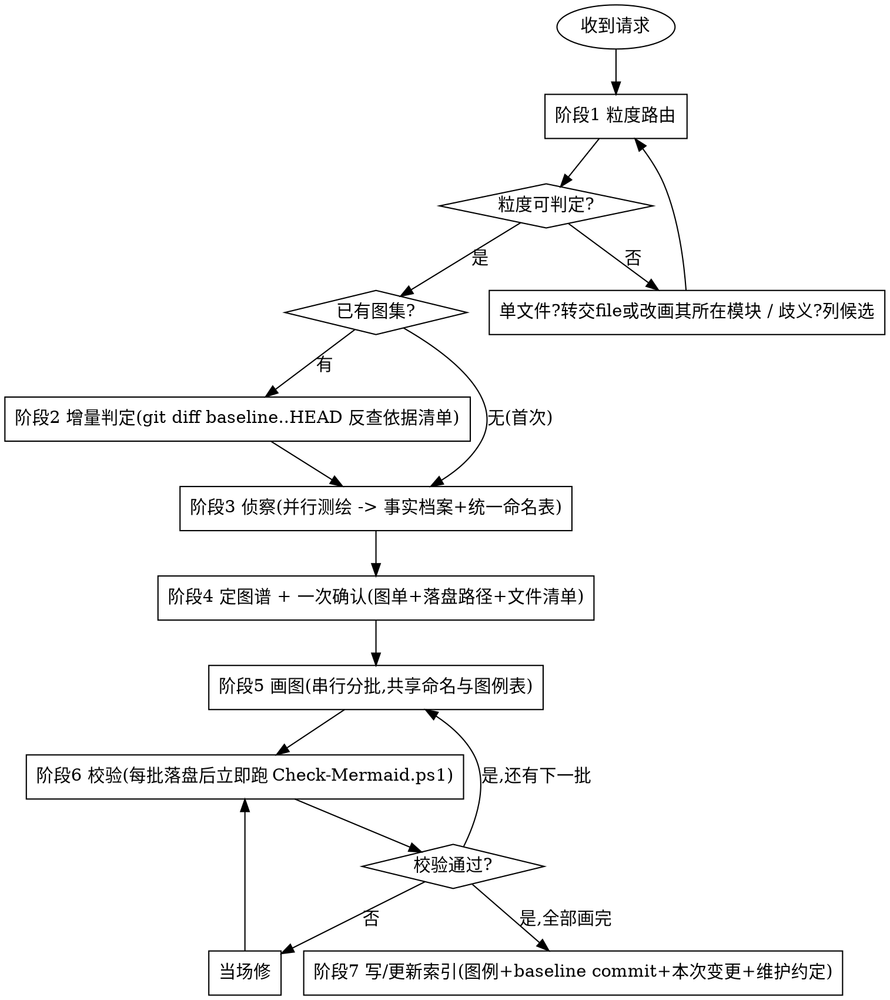

# 代码库图集 (codebase-diagrams)

把一个代码库画明白，产物是一套**能跟着代码一起演进**的 Mermaid 图，而不是一张很快过时的架构图截图。

支持三个粒度：**整个项目 / 单个模块 / 单个方法入口**。侦察代码 → 判定项目类型与粒度 → 从 51 张图谱里自适应挑选 → 一次确认 → 成批画完 → 结构校验 → 落盘并写索引。

> 与 `code-read-deep-*` 家族的分工：**它们出「中文阅读报告」（图是报告里的 1~3 张插图），本 skill 出「图集」（文字是图注）**。
> 判据三条：**产物**（图集落盘 vs 阅读报告）、**张数**（≥5 张成套 vs 1~3 张插图）、**动词**（画 / 出图 / 可视化 / 补一套图 vs 读懂 / 梳理 / 带我看）。

---

## 为什么是成套 Mermaid，而不是单张 SVG

| | 单张架构图 | 成套 Mermaid 图集 |
|---|---|---|
| 信息密度 | 一张图塞不下分层、时序、状态、排障 | 按用途分文件，读者按需取 |
| 维护 | 改代码后没人改图，半年后骗人 | 源码进版本库，能 diff、能 review、改代码顺手改图 |
| 增量 | 只能整张重画 | 图注内嵌依据文件清单，`git diff` 就能定位该重画哪几张 |
| 场景覆盖 | 只服务「介绍项目」 | 还服务联调、排障、容量规划、交接 |

---

## 核心定位

- **图驱动**：产物是图集，不是阅读报告。文字只做图注与对照表，不写成通读报告。
- **自适应，不凑数**：从 51 张图谱里按「项目类型 × 粒度」挑，**没有的东西不硬画**——无状态的项目不画状态机，没有 MQ 不画消息拓扑。一张图去掉之后读者理解毫无损失，就不该存在。
- **只读不改业务代码**：全程不编辑任何源码，只写 `docs/diagrams/` 下的图集文件。
- **活文档**：不带日期戳，重跑覆盖；README 记 baseline commit，重跑走增量。
- **多语言到框架层**：语言 → 构建 → **框架**三层都识别，并做 polyglot 项目的跨语言连边。
- **画不准宁可不画**：拿不准的边标 `⚠推断`，读不到的部分在索引里写明「未覆盖，原因 XX」。

---

## 硬性前置：三个粒度的闸门

> 先判定粒度，再做其他任何事。

| 输入形态 | 判定 | 处理 |
|---|---|---|
| 仓库根 / 无参数 / 「这个项目」 | **项目级** | 直接开工 |
| 目录路径（`src/order`）、包名（`com.example.order`） | **模块级** | 直接开工 |
| `类名.方法名`（`OrderService.createOrder`、`account.transfer`、`(*OrderRepo).Save`）且能唯一定位到方法 | **方法入口级** | 直接开工 |
| **单个源文件**（`OrderService.java`、`payment_service.py`） | **不适用** | 见下方标准回应 |
| 歧义形态（`order` 既是目录又是类；`orderApi.fetchOrders` 可能是对象方法也可能是模块导出） | **待定** | **列候选让用户选，不擅自猜** |

**单文件的标准回应：**

> 本 skill 只做项目 / 模块 / 方法入口三个粒度。单个文件的图只有「结构图 + 依赖图」2~3 张，够不上成套图集。两条路：
> ① 想读懂这个文件并拿结构图与依赖图 → 用 `code-read-deep-file`；
> ② 想要成套图集 → 我按它所在的模块 `<推断出的模块目录>` 画模块级图集，你确认一下这个模块边界对不对。

**歧义形态的标准回应：** 列出全部候选（路径 + 类型 + 一句话说明），请用户选，不默认取第一个。

---

## 何时使用 / 何时不用

**使用本 skill：**
- 想给项目 / 模块 / 某个入口**补一套图**并沉淀进仓库。
- 想要成套（≥5 张）的架构、逻辑、数据、时序、状态、工程运维图。
- 图要**跟着代码演进**，改代码后能增量更新，而不是一次性截图。
- 为新人导览、交接、评审、汇报准备项目图示。

**不要用本 skill（改走对应能力）：**

| 需求 | 改用 |
|---|---|
| 读懂整个项目 / 仓库，要一份中文阅读报告 | `code-read-deep-project` |
| 读懂单个模块 / 目录 / 包 | `code-read-deep-module` |
| 读懂单个源文件 | `code-read-deep-file` |
| 读懂单个方法入口的调用链与数据流 | `code-read-deep-function` |
| 顺一条横切线索（认证 / 缓存 / 某字段）端到端 | `code-read-deep-trace` |
| 读懂一次变更 / PR / diff 的影响半径 | `code-read-deep-change` |
| 与具体代码无关的概念示意图、单张独立插图 | `baoyu-diagram`（SVG） |
| 数据图表、仪表盘、统计可视化 | `dataviz` |
| 代码质量审查 / 安全审计 / 性能审查 | `code-review-deep-zh` |
| 给代码加注释 | `code-annotating` |
| 一句话解释一小段代码 | `/explain` |

---

## 工作流程

按顺序执行，不要跳阶段。详细规则按需加载对应 `references/` 文件。



### 阶段 1：粒度路由

按上方闸门表判定粒度。单文件形态转交，歧义形态列候选。**判定结果要说出来**（「按项目级画」/「按模块级画，模块根 = `src/order`」），让用户有机会当场纠正。

### 阶段 2：增量判定（已有图集时）

1. 读 `docs/diagrams/README.md`，取出 **baseline commit**。
2. 跑 `git diff <baseline>..HEAD --stat` 拿到变更文件清单。
3. 逐张读已有图的**图注依据清单**（每张图的图注里写着「依据：`a.java`, `b.ts`」），命中变更文件的图进「待重画」集合。
4. 变更文件里出现**新目录 / 新构建文件 / 新外部依赖**时，额外把架构类图纳入待重画。
5. 产出：待重画图清单 + 不动的图清单，进阶段 4 一起确认。

**目标仓库不是 git 仓库、或找不到 baseline commit** → 退化为全量重画，并在索引里写明「无 baseline，本次为全量重建」。

### 阶段 3：侦察（并行测绘 → 事实档案）

**README 会过时，代码不会。** 按这个顺序读，边读边记「这里有个非显然的决定」：

1. **骨架**：目录树、构建文件、CI 配置、主配置文件。
2. **入口**：控制器 / 路由 / CLI 命令 / 消息消费者 / 定时任务——确定系统对外的全部入口。
3. **核心链路**：从一个入口顺着调用链读到底，把最重要的那条业务链路完整读完。
4. **横切设施**：缓存、重试降级、鉴权、持久化、事务、可观测性、并发与锁。
5. **事实核对**：需要写进图里的数字，**当场用命令数出来**，不要凭印象。

项目级规模大时**派并行子代理分模块测绘**（每个子代理只读不画，回传结构化事实），主上下文只做汇总。

**本阶段唯一产物是「事实档案」**，它是后续所有图的唯一事实来源：

| 档案项 | 内容 |
|---|---|
| **统一命名表** | 每个组件的**唯一显示名** + 它在代码里的全部别名。跨图一致性完全靠这张表 |
| 组件清单 | 组件 → 所在文件 → 一句话职责 |
| 依赖边 | 来源 → 目标 → 边类型（import / HTTP / MQ / DB / DI 注入）→ 确定性（确定 / ⚠推断） |
| 关键数字 | 数值 + **出处**（配置默认值 / 实测 / 数出来的命令） |
| 项目类型标记 | 有无 MQ / 有无状态机 / 有无缓存 / 有无分布式事务 / 有无定时任务 / 有无鉴权 / 是否 polyglot …… 这些标记直接驱动阶段 4 的挑图 |

多语言识别规则见 `references/language-build-detection.md`；框架层依赖读取与跨语言连边见 `references/framework-lenses.md`。

### 阶段 4：定图谱 + 一次确认

打开 `references/diagram-catalog.md`，按**项目类型标记 × 粒度**从 51 张里挑。挑选原则：

- **⭐ 骨架必画**，除非事实档案证明不适用。
- **○ 按需**：只画那些「看代码看不出来、但踩过坑」的地方。
- **⚠ 慎画**：默认不画，事实档案有明确证据才画。
- **不画代码本身已经讲清楚的东西**。把每个方法都画成流程图，只是代码的低保真复制。

**这是全流程唯一一次打断用户**，一次把话说完：

```
粒度：项目级（仓库根 D:\Code\myapp）
拟画 26 张，分 5 类：
  架构与结构 7 张 —— 系统上下文、容器、分层、模块依赖(含环)、部署拓扑、技术栈全景、API 全景
  行为与流程 6 张 —— ...
  ...
不画的及原因：
  状态机图 —— 未发现有状态实体（无 status/state 字段的状态迁移）
  消息拓扑图 —— 未发现 MQ 依赖
  ...
落盘到：D:\Code\myapp\docs\diagrams\
将新增 7 个文件：README.md、project/01-架构与结构.md、...
要加要减吗？
```

用户确认后**不再打断**，一路画到底。

### 阶段 5：画图（串行分批）

**按类别分批**，每批画完立即落盘再画下一批。全程共享阶段 3 的**统一命名表**与本次的**图例约定**——这是跨图一致性的唯一保障。

每张图固定三件套，缺一不可（模板与要求见 `references/quality-standards.md`）：

1. **图注** —— 这张图回答什么问题 + 对应哪段代码 + **依据文件清单**（增量更新靠它）
2. **Mermaid 图** —— 图讲结构与流向
3. **对照表** —— 表讲参数、阈值、取值、账本

Mermaid 语法陷阱、降级模板（C4 / 部署 / 网络边界统一用 `flowchart` + `subgraph` 模拟）、配色与线型约定见 `references/mermaid-conventions.md`——**动手画之前先读它**，能省掉一轮「图渲染不出来」的返工。

### 阶段 6：校验（每批落盘后立即跑）

Mermaid 语法错误在 Markdown 里**不报错**，只是渲染成一坨红字，而你多半看不到渲染结果。所以每批落盘后立即：

```powershell
pwsh -NoProfile -File <skill-dir>/scripts/Check-Mermaid.ps1 -Path <目标仓库>/docs/diagrams
```

退出码非 0 就是有问题，**当场修，不要留到最后**。脚本做结构校验（代码栏闭合、块与 `end` 配对、边标签竖线成对、标签内高危字符、节点 id 合法性），抓 ~90% 的实际错误。

图集要对外发布、或用户明确要求时，再额外跑一次真渲染验证（`npx -y @mermaid-js/mermaid-cli`——**这个包很大，会拉 puppeteer + chromium，只在必要时用**）。

### 阶段 7：写 / 更新索引

图集不写索引就没人找得到。`docs/diagrams/README.md` 必须有：

1. **一句话讲清这个系统**，外加「只看一张图的话看哪张」。
2. **目录表**：文件 → 内容 → 图数 → **主要读者**（新人 / 联调 / 值班 / 汇报）。
3. **图例约定**：配色代表哪一层、线型代表什么。全套图共用一份，各图不重复。
4. **baseline commit**：`本图集基于 abc1234 生成于 YYYY-MM-DD`——增量更新的锚点，**不能漏**。
5. **本次变更**：首次写「全新生成」；增量写「重画了图 X.Y、X.Z，因为 `a.java` `b.ts` 有变更；其余未动」。
6. **未覆盖声明**：读不到 / 画不准的部分照实写「未覆盖：XX，原因：YY」。
7. **维护约定**：具体到图号——「改了检索链路 → 同步更新 `02-行为与流程.md` 的图 2.1/2.2 与 `03-数据.md` 的图 3.1」。

---

## 产物结构

```
<目标仓库>/docs/diagrams/
├── README.md                    # 索引 + 图例约定 + baseline commit + 变更记录 + 维护约定
├── project/                     # 项目级
│   ├── 01-架构与结构.md
│   ├── 02-行为与流程.md
│   ├── 03-数据.md
│   ├── 04-工程与运维.md
│   └── 05-演进与决策.md
├── modules/<模块名>/
│   └── 图集.md
└── entries/<类名.方法名>/
    └── 图集.md
```

- **内容文档一律中文名**，数字前缀承载阅读顺序。`README.md` 是唯一例外（GitHub / IDE 自动识别为索引页）。
- 单文件超 ~800 行就拆，拆出的同样中文名：`02a-核心链路.md`、`02b-异常与降级.md`。
- 小项目可把 5 个文件合并成 2~3 个。
- 目标仓库已有文档目录约定（如 `docs/design/`）时**跟随它**，不要硬造新目录。

---

## 规范化自检（交付前必过）

- [ ] 粒度判定说出来了，用户有机会纠正。
- [ ] 阶段 4 的确认里同时给了**图单 + 不画的原因 + 落盘根目录 + 将新增的文件清单**。
- [ ] 全流程**只打断用户一次**（阶段 4）。
- [ ] 每张图都有**三件套**：图注（含依据文件清单）、Mermaid、对照表。
- [ ] 同一组件在所有图里**同名、同色、同线型**（对照统一命名表逐张核）。
- [ ] 图里每个数字都有出处；拿不准的写量级或范围，不写具体数。
- [ ] 每条主链路都覆盖了**失败 / 超时 / 并发 / 空数据**分支，不是只有 happy path。
- [ ] 不确定的边标了 `⚠推断`，缺口（无鉴权 / 无限流 / 无多租户隔离）照实标 ⚠。
- [ ] `Check-Mermaid.ps1` 退出码为 0。
- [ ] README 七项齐全，**baseline commit 已写**。
- [ ] 没有一张图是「去掉之后读者理解毫无损失」的。

---

## 与其他能力的边界

| 能力 | 它做什么 | 与本 skill 的区别 |
|------|---------|------------------|
| `code-read-deep-project` | 通读整个项目，出 10 段中文阅读报告 + 3 张插图 | 本 skill 出**成套图集**并落 `docs/diagrams/`，不写通读报告 |
| `code-read-deep-module` | 通读单个模块，出 10 段报告 + 3 张插图 | 同上 |
| `code-read-deep-file` | 通读单个文件，出报告 + 2 张插图 | **本 skill 不做单文件粒度**，遇到就转交 |
| `code-read-deep-function` | 深挖单方法调用链，出报告 + 2 张插图 | 本 skill 在方法入口粒度出 6~8 张成套图并落盘 |
| `code-read-deep-trace` | 顺一条横切线索追踪，出报告 + 2 张插图 | 本 skill 按容器粒度成套画，不追单条线索 |
| `code-read-deep-change` | 读一次变更的影响半径，出报告 + 1 张图 | 本 skill 画现有代码，不画 diff |
| `baoyu-diagram` | 单张概念示意图，输出 SVG | 本 skill 画的是**这个仓库里的代码**，输出 Mermaid |
| `dataviz` | 数据图表、仪表盘、统计可视化 | 本 skill 画结构与流程，不画数据分布 |
| `code-review-deep-zh` | 10 维度深度质量审查 | 本 skill 只画图，问题只在图上标 ⚠ 不展开评判 |

---

## 常见失败模式

| 症状 | 后果 | 怎么改 |
|------|------|--------|
| 三个方框「前端-后端-数据库」 | 零信息量，读者看完还是不知道怎么回事 | 下沉到具体类名、具体分支、具体阈值 |
| 把每个方法画成一个节点 | 代码的低保真复制，还更难读 | 一张图聚焦一个问题，方法级细节交给代码 |
| 一张巨图什么都塞 | 谁都看不懂，且必然过时 | 按「回答什么问题」拆图 |
| 只有主流程没有分支 | 排障时用不上，最需要图的时候没图 | 每条链路补失败、超时、并发、空数据 |
| 图谱全画满凑数 | 无状态项目里的状态机图、没 MQ 项目里的消息拓扑图 | 事实档案没证据就不画，在索引里写明为什么不画 |
| 同一组件在不同图里叫不同名字 | 整套图像三个人拼的，读者对不上 | 严格用统一命名表，画完逐张核 |
| 数字凭印象 | 一处出错整套可信度归零 | 当场数、当场读配置，写明出处 |
| polyglot 项目前后端画成两座孤岛 | 架构图缺了最该说清楚的那条边 | 用 HTTP 路径 / MQ topic / DB 表名三种匹配连边，不确定标 ⚠推断 |
| 画完不校验 | 渲染成红字，白干 | 每批落盘后立即跑 `Check-Mermaid.ps1` |
| 没写 baseline commit | 下次重跑只能全量重画，增量机制失效 | README 必须记 baseline commit |
| 没有索引和维护约定 | 三个月后没人知道有这套图，也没人更新 | README 七项齐全，维护约定具体到图号 |
| 自作主张不告知就写一堆文件 | 用户仓库突然多出 20 个文件 | 阶段 4 确认时把落盘路径与文件清单一并列出 |

---

## 引用文件

| 文件 | 内容 | 什么时候读 |
|---|---|---|
| `references/diagram-catalog.md` | **51 张图谱清单**：每张回答什么问题、用哪种 Mermaid 图种、什么项目值得画，外加**粒度 × 图种矩阵** | 阶段 4 定图谱时 |
| `references/language-build-detection.md` | 多语言 ①② 层：语言识别、构建文件解析、模块边界判定、polyglot 分区 | 阶段 3 侦察开始时 |
| `references/framework-lenses.md` | 多语言 ③ 层：各框架「依赖到底读哪里」、接口 vs 实现类进图规则、**跨语言连边三法** | 阶段 3 识别出框架后 |
| `references/mermaid-conventions.md` | 语法陷阱、降级模板、配色与线型约定、各图种模板 | 阶段 5 **动手画之前** |
| `references/quality-standards.md` | 三件套模板、数字出处要求、异常路径覆盖、诚实标注缺口 | 阶段 5 动手画之前 |
| `scripts/Check-Mermaid.ps1` | 结构校验脚本 | 阶段 6 每批落盘后 |
