目录：[语法陷阱](#一会让图渲染失败的写法) · [线型与配色](#二线型与配色约定) · [降级模板](#三降级模板mermaid-画不好的图种) · [各图种模板](#四各图种模板)

# Mermaid 语法陷阱 · 视觉约定 · 图种模板

**阶段 5 动手画之前先读这份文件**，能省掉一轮「图渲染不出来」的返工。

---

## 一、会让图渲染失败的写法

Mermaid 语法错误在 Markdown 里**不报错**，只是渲染成一坨红字。下面这些是实际最常撞的。

| # | 陷阱 | 错误写法 | 正确写法 |
|---|---|---|---|
| 1 | **`end` 当小写节点 id** —— flowchart 里 `end` 是块结束符，必炸 | `A --> end` | `A --> END["结束"]` |
| 2 | **标签里的半角括号 / 方括号 / 花括号** | `A[pay(amount)]` | `A["pay(amount)"]` |
| 3 | **标签里的双引号** | `A["说"引用"话"]` | `A["说#quot;引用#quot;话"]` |
| 4 | **标签里的裸 `#`** —— `#` 是实体转义前缀 | `A[#1 订单]` | `A["#35;1 订单"]` 或改写成 `A["No.1 订单"]` |
| 5 | **边标签竖线不成对** —— 漏一个整图炸 | `A -->\|下单 B` | `A -->\|下单\| B` |
| 6 | **`subgraph` 漏 `end`** —— 嵌套时最容易漏 | 3 个 `subgraph` 配 2 个 `end` | 逐个配对，缩进对齐 |
| 7 | **换行用 `\n`** | `A[订单\n服务]` | `A["订单<br/>服务"]` |
| 8 | **节点 id 含空格 / 中文 / 中文标点** | `订单 服务 --> DB` | `SVC["订单服务"] --> DB` —— **id 用 ASCII，中文放标签** |
| 9 | **sequenceDiagram 的块忘了 `end`** —— `alt` `opt` `loop` `par` `critical` `rect` **都要** `end` | `alt` 后直接下一段 | 每个块配一个 `end` |
| 10 | **classDiagram 用尖括号泛型** | `List<String>` | `List~String~` |
| 11 | **代码栏没闭合** | 只有开头的 ```` ```mermaid ```` | 结尾必须有 ```` ``` ```` |
| 12 | **sequenceDiagram 消息里用半角冒号** —— 半角 `:` 是消息分隔符 | `A->>B: 状态: 已支付` | `A->>B: 状态：已支付`（用全角冒号） |
| 13 | **节点 id 以单个 `o` / `x` 开头** —— `A --- oB` 会被解析成圆头箭头 | `A --- oB` | `A --- ordB` 或 `A --- o_B` |
| 14 | **用 `graph` 而不是 `flowchart`** —— `graph` 是旧语法，新特性不支持 | `graph TD` | `flowchart TD` |
| 15 | **`linkStyle` 按索引指定边** —— 加一条边索引就全错位 | `linkStyle 3 stroke:red` | 少用；改用 `classDef` + `:::` 给节点上色 |

**中文文本本身没问题**，中文标点也基本没问题——但**只要标签里出现任何标点，就整体加双引号**，这条守住能规避掉一半的坑。

---

## 二、线型与配色约定

全套图共用一份图例，写在 `README.md` 里，**各图不重复写**。

### 线型（比配色可靠，优先靠线型表达语义）

| 线型 | 含义 | 写法 |
|---|---|---|
| `-->` 实线箭头 | **确定的**同步调用 / 依赖 | `A --> B` |
| `==>` 粗实线 | **主链路**（一张图里只标一条） | `A ==> B` |
| `-.->` 虚线 | **不确定的边（⚠推断）** 或 **异步 / 事件驱动** —— **必须靠边标区分** | `A -.->\|"⚠推断"\| B` / `A -.->\|"异步"\| B` |
| `--x` 带叉 | 失败路径 / 消息丢失 / 超时未响应 | `A --x B` |
| `--o` 带圈 | 可选路径 / 条件才走 | `A --o B` |

**虚线必须带边标**——不带边标的虚线读者分不清是「推断的」还是「异步的」，这是两件完全不同的事。

### 配色（次要手段，因为深色主题下自定义 fill 可能难读）

| 角色 | classDef | 用在哪 |
|---|---|---|
| 入口 / 接入层 / 角色 | `fill:#E3F2FD,stroke:#1565C0` | Controller、Router、CLI、用户 |
| 业务 / 领域层 | `fill:#E8F5E9,stroke:#2E7D32` | Service、UseCase、领域对象 |
| 数据 / 存储层 | `fill:#FFF3E0,stroke:#EF6C00` | DAO、Repository、DB、缓存、MQ |
| 外部系统 / 三方 | `fill:#ECEFF1,stroke:#546E7A` | 第三方 API、外部服务 |
| 问题 / 缺口标注 | `fill:#FFEBEE,stroke:#C62828` | ⚠ 无鉴权、单点、已知缺陷 |
| 本系统（上下文图专用） | `fill:#E8F5E9,stroke:#2E7D32,stroke-width:2px` | #1 里的中心盒子 |

标准 classDef 块，**每张用色的图末尾都粘一份**：

```
    classDef entry fill:#E3F2FD,stroke:#1565C0;
    classDef biz   fill:#E8F5E9,stroke:#2E7D32;
    classDef store fill:#FFF3E0,stroke:#EF6C00;
    classDef ext   fill:#ECEFF1,stroke:#546E7A;
    classDef warn  fill:#FFEBEE,stroke:#C62828;
```

用法：`API["OrderController"]:::entry`

**深色主题注意**：上面这组 fill 是浅色，配深色 stroke，在 GitHub 深色主题下文字仍为深色可读。**不要用深色 fill**（如 `#1565C0` 当 fill），深色主题下会和文字撞色。

---

## 三、降级模板（Mermaid 画不好的图种）

`C4Context` / `C4Container` 是 **experimental** 语法，GitHub 渲染不稳、排版控制弱。`architecture-beta` 仍是 beta。**统一降级为 `flowchart` + `subgraph` 模拟**，模板如下，照抄改名即可——这样每次生成的风格才一致。

### #1 系统上下文图（C4 L1 降级）

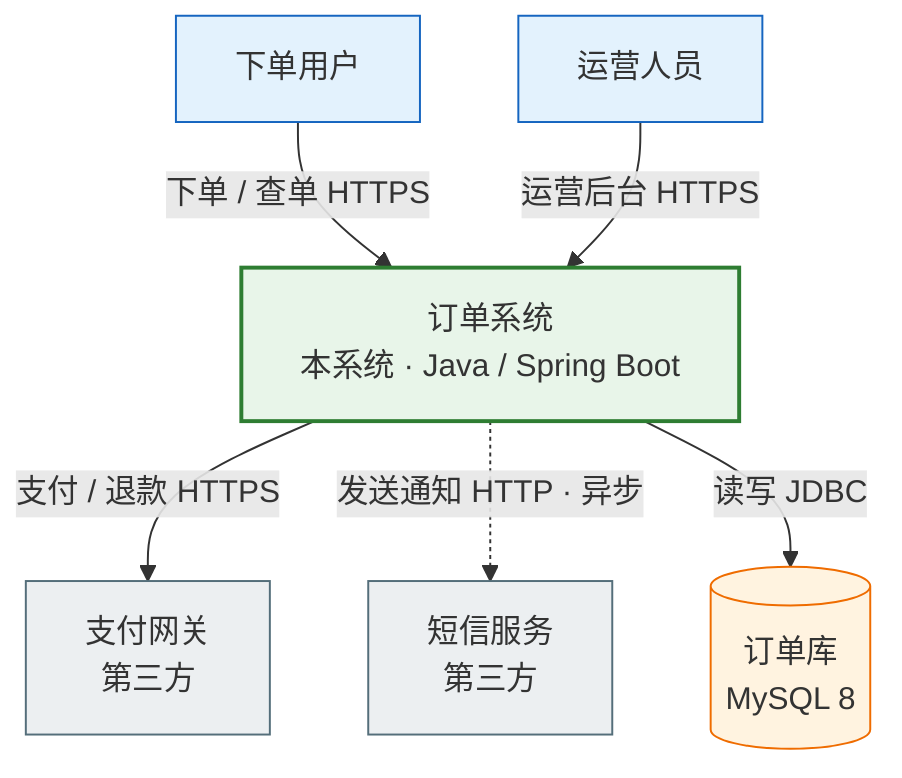

### #2 容器 / 部署单元图（C4 L2 降级）

**每个容器要标语言与技术栈**——这是容器图区别于组件图的关键。

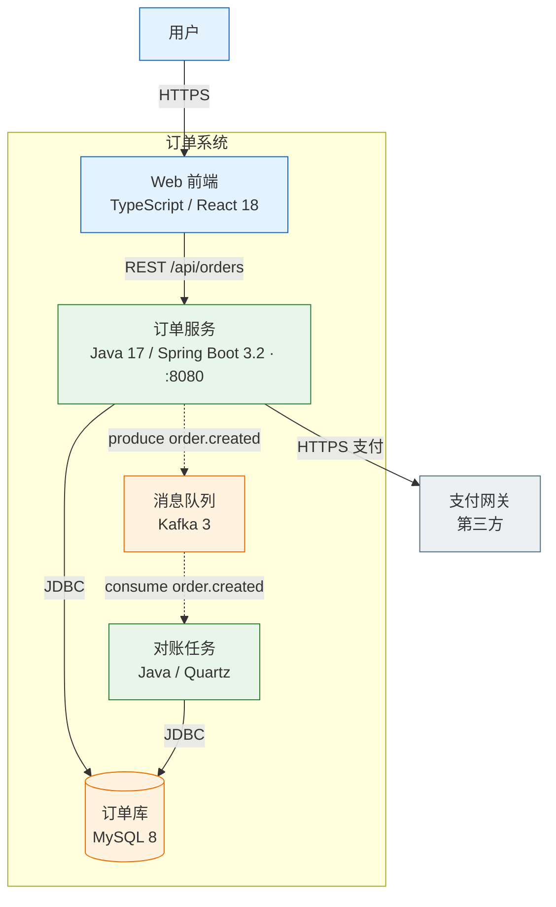

### #6 部署拓扑图 / #7 网络与信任边界图

同样用 `flowchart` + **嵌套 subgraph 表示边界**。信任边界用 subgraph 标题写清楚。

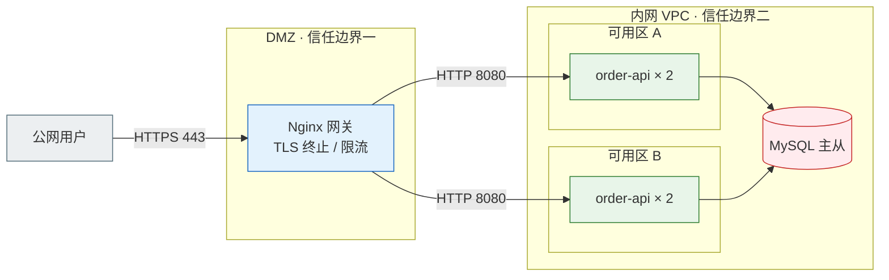

> 上例中 DB 标了 `warn`，图注要写清为什么：「⚠ 主从同步为异步，主库故障时有秒级数据丢失窗口」。

---

## 四、各图种模板

### #4 分层架构图 —— 重点是把**跨层调用**标出来

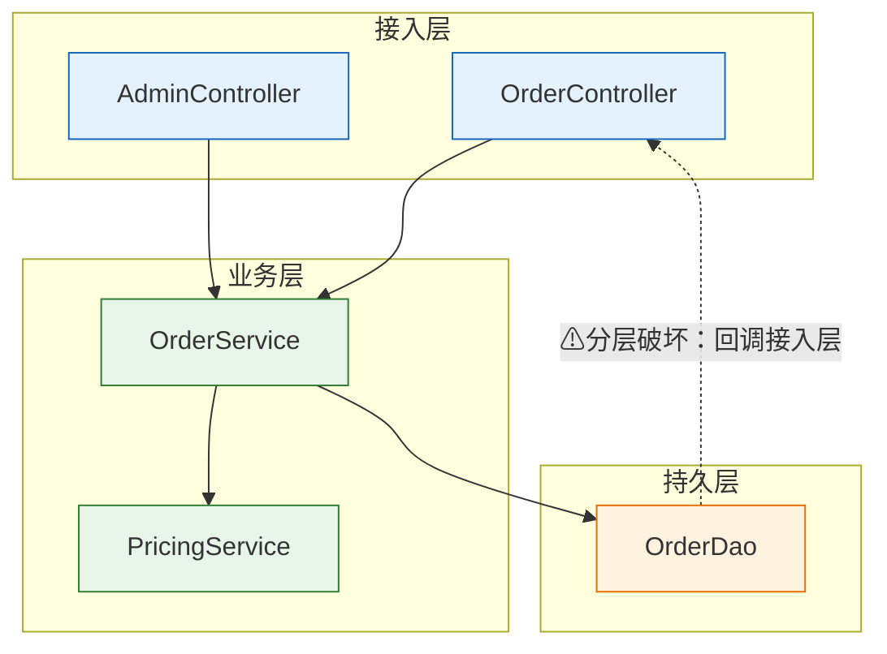

### #5 依赖图 —— 必须下环检测结论

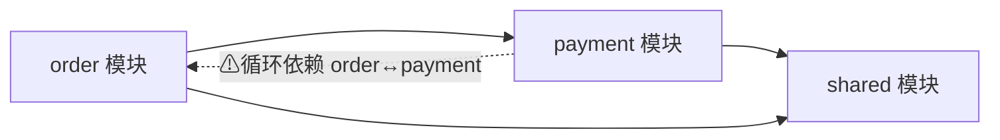

图下方配文字结论：**「环检测：发现 1 个环 order → payment → order，成因是 payment 回调 order 的状态更新。」** 只画图不下结论等于没画。

### #13 业务流程图 —— 必须有分支

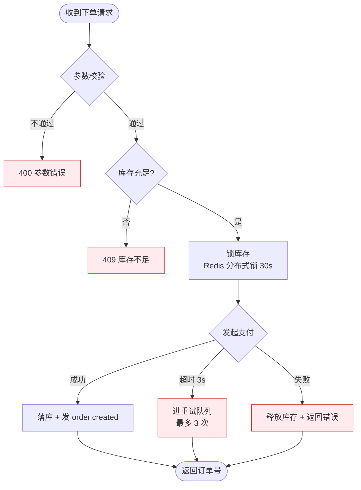

> 注意结束节点叫 `END` 不叫 `end`（陷阱 #1）。

### #14 / #15 时序图 —— 异常分支用 `alt` / `else`

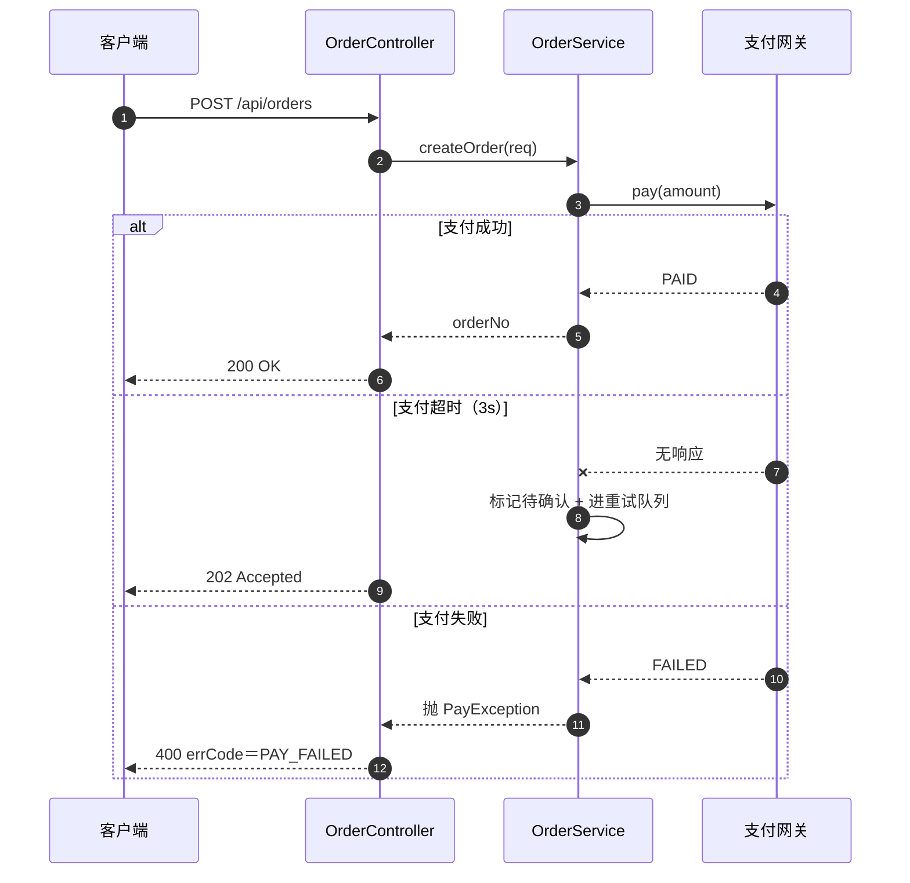

### #16 状态机图

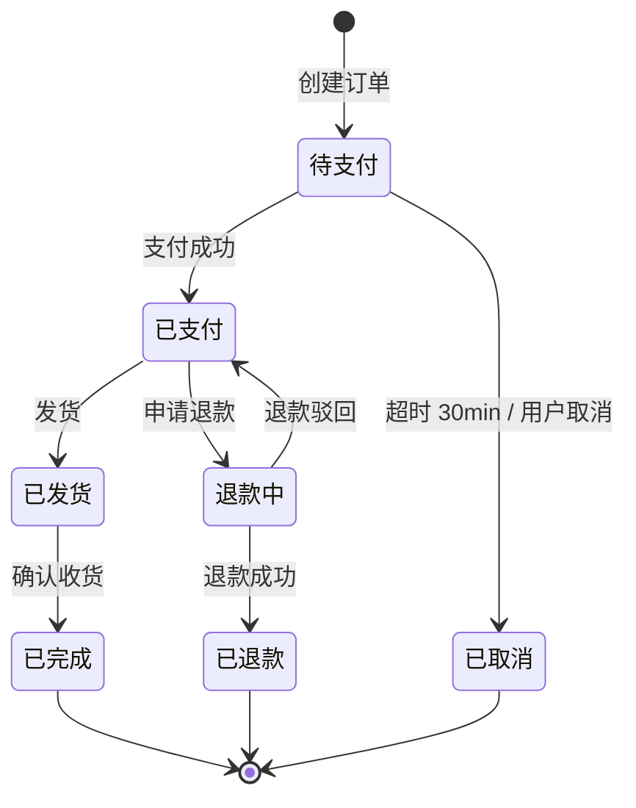

### #25 数据流转图 —— 节点是**数据形态**，不是类名

这是它区别于调用链图 #18 的根本点。

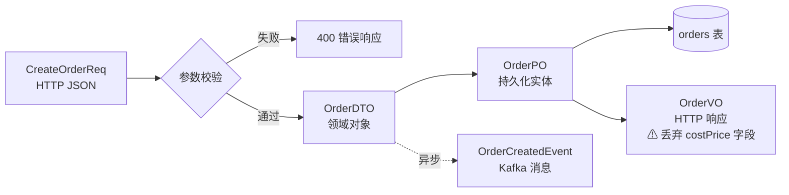

### #26 ER 图

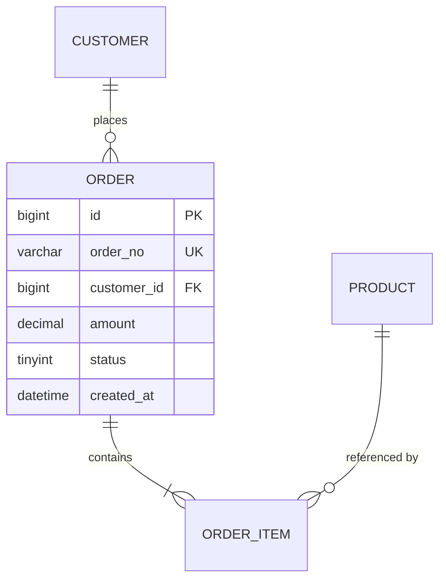

### #10 核心域类图

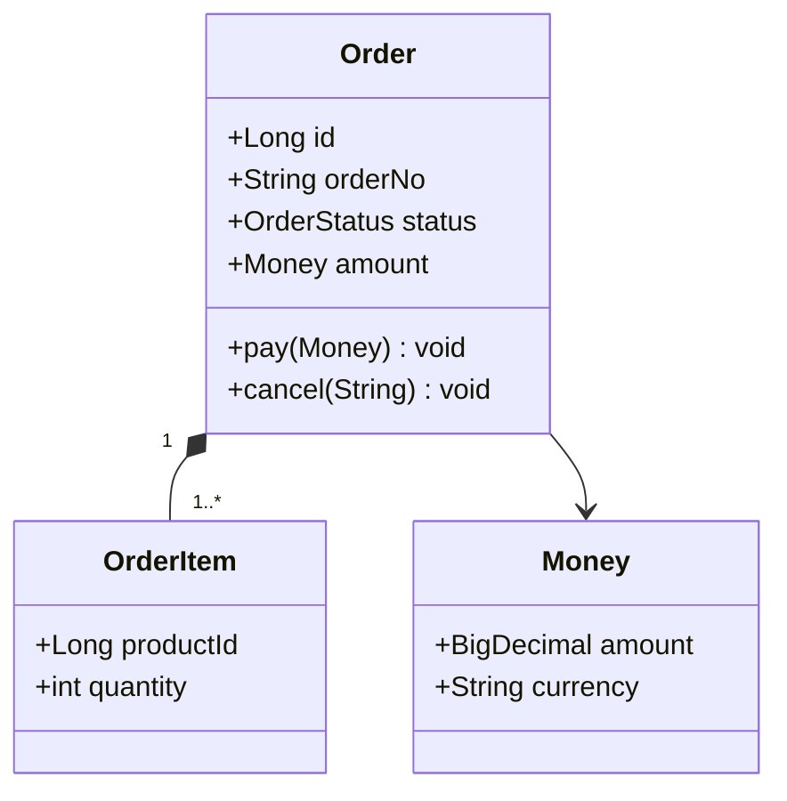

### #8 技术栈全景图

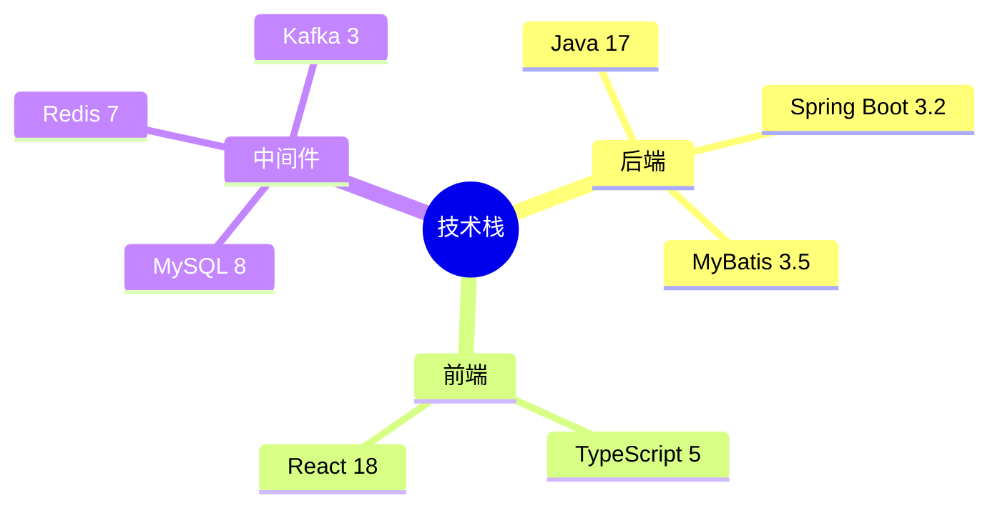

### #35 分支与发布模型图

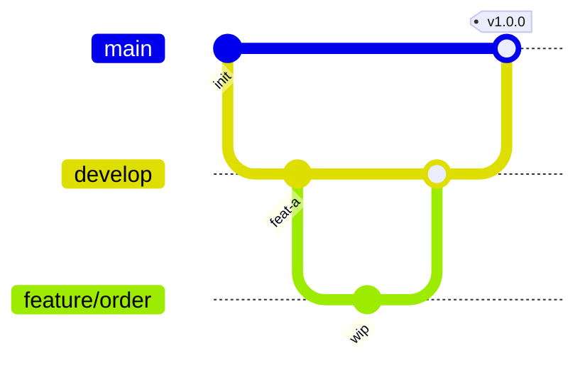

### #46 架构演进时间线

素材来自 `git log --pretty=format:"%ad|%s" --date=short`，**不要凭印象编时间点**。

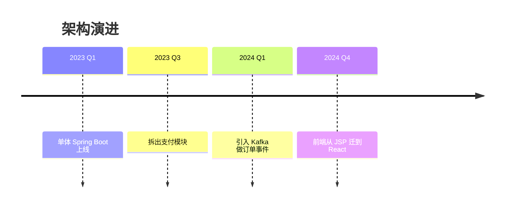

### #34 CI/CD 流水线图 —— 门禁条件标在边上

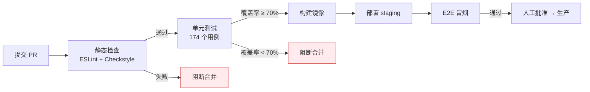

> 「174 个用例」这种数字**必须当场数出来**（`grep -rc "@Test" ... | awk ...`），不能抄 README 或注释。

---

## 五、画完必做

```powershell
pwsh -NoProfile -File <skill-dir>/scripts/Check-Mermaid.ps1 -Path <目标仓库>/docs/diagrams
```

退出码非 0 就是有问题，**当场修**。需要 100% 确认时再额外跑真渲染（`npx -y @mermaid-js/mermaid-cli`，包很大，只在必要时用）。
