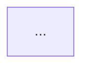

# 质量标准 · 三件套模板 · 索引模板

阶段 5 动手画之前读。这份标准是把「能看」和「有用」分开的关键。

---

## 一、每张图的三件套（缺一不可）

````markdown
## 图 2.1 下单主链路

**回答**：一次下单请求经过哪些组件、在哪些点会分叉。
**对应代码**：`OrderService.createOrder()`（`order/src/main/java/com/example/order/OrderService.java:42`）
**依据**：`OrderService.java`、`OrderController.java`、`InventoryClient.java`、`application.yml`
                                                          ← ① 图注：三行，最后一行是增量更新的命脉


                                                          ← ② 图本身：讲结构与流向

**关键参数账本**
| 参数 | 取值 | 出处 |
|------|------|------|
| 库存锁超时 | 30s | `application.yml: order.lock.ttl` |
| 支付超时 | 3s | `PayClient.java:28` 硬编码 |
| 重试次数 | 3 | `application.yml: order.retry.max` |
                                                          ← ③ 对照表：讲参数、阈值、账本

**三处画不下的细节**
1. 锁库存用的是 Redis 分布式锁，**不是** DB 行锁——换存储要重新设计。
2. 支付超时后走 202 而非 500，是为了让客户端轮询而不是重试下单。
3. `costPrice` 字段在转 VO 时被丢弃，前端拿不到——这是有意的，别"修"。
                                                          ← ④ 图上画不下的「为什么」
````

**图与表是互补的**：图讲结构与流向，表讲参数与对照。想在图里塞满数字，结果是既看不清结构也查不到数字。

### 「依据」这一行为什么不能省

它是**增量更新机制的唯一支撑**。重跑时的逻辑是：

```
git diff <baseline>..HEAD --stat   →   变更文件清单
                                         ↓ 逐张比对图注的「依据」行
                                   命中的图 → 待重画
                                   未命中  → 原样保留
```

省了这一行，下次重跑只能全量重画 25 张图——成本高到你不会跑，图就死了。

**写法要求**：写**文件名或路径**，不写「订单相关代码」这种模糊描述；配置文件也算依据（阈值变了图就该更新）。

---

## 二、画「为什么」，不只画「是什么」

代码能自己讲清楚的，图不用重复。图的独特价值在于承载**代码里看不见的决策**：

| 画什么 | 例子 |
|--------|------|
| **不对称设计** | 「索引用节点自身正文、取内容用子树正文」——两处都不能想当然改成一致 |
| **取舍与代价** | 「写操作串行化的代价可忽略，而磁盘内存不一致的代价很高，所以整方法加锁」 |
| **反直觉的坑** | 「`LinkedHashMap` 的 `accessOrder=true` 让读也变成写，所以读方法也必须加锁」 |
| **阈值的来历** | 「300 这个数是从 63.2 字符/节点反推 1 万 token 得来的，换模型要重新推」 |
| **边界与降级** | 「首 token 之后不能再切模型，否则回答是两个模型输出的拼接」 |
| **有意的不一致** | 「`costPrice` 转 VO 时丢弃是有意的——别当 bug 修」 |

**删除测试**：一张图如果去掉之后读者的理解毫无损失，就不该存在。挑图时（阶段 4）过一遍，画完再过一遍。

---

## 三、数字要有出处

图里出现的每个数字，要么来自**配置默认值**、要么来自**实测**、要么是**数出来的**。

```bash
# 测试数量——不要抄 README 或注释
grep -rc "@Test" src/test --include=*.java | awk -F: '{s+=$2} END {print s}'
grep -rc "def test_" tests --include=*.py | awk -F: '{s+=$2} END {print s}'

# 接口数量
grep -rn "Mapping\|@app.route\|router\.\(GET\|POST\)" src -o | wc -l

# 演进时间线素材
git log --pretty=format:"%ad|%s" --date=short | head -40
```

**真实教训**：某项目 CI 注释写「156 个用例」，实际 `@Test` 数是 174。图里照抄注释，第一个数字就是错的，整套图的可信度当场归零。

**拿不准就写量级或范围，不写具体数**。性能数据尤其要标注波动范围——「P99 约 4.6ms」和「run-to-run 波动可达 2 倍，请引用范围而非单点」要一起出现。

---

## 四、覆盖异常路径

只画 happy path 的图是半成品。**每条主链路都要问五遍**：

1. **失败**怎么走？
2. **超时**怎么走？
3. **并发**怎么走？
4. **空数据**怎么走？
5. **缓存命中 / 未命中**分别怎么走？

这些分支往往才是排障时真正要看的。图谱里的 #15（异常/超时/降级路径图）之所以是 ⭐ 骨架，就是因为它是唯一专门回答这些问题的图。

---

## 五、诚实标注缺口

发现「当前没有鉴权」「没有限流」「没有多租户隔离」「主从同步是异步的」这类事实，**照实画出来并标 ⚠**（用 `warn` classDef）。

- 假装完美的图集在评审时会当场崩。
- 标出缺口的图集会显得你真读懂了这个系统。

这不是唱衰，是把已知约束交给读者判断。

同样地：**不确定的边标 `⚠推断`**（见 `framework-lenses.md` 第十节）。一张标了 3 条 `⚠推断` 的图，读者知道该去核对哪 3 处；一张全是实线但其中 3 条是猜的图，读者会全盘相信，然后在这 3 处踩坑。

---

## 六、跨图一致性检查

画完每一批后，对着阶段 3 的**统一命名表**逐张核：

- [ ] 同一组件在所有图里是**同一个显示名**（不能 A 图 `OrderService`、B 图 `订单服务`、C 图 `order-svc`）。
- [ ] 同一角色的组件用**同一个 classDef**（所有 Service 都是 `biz`，不能有的用 `entry`）。
- [ ] 同一种关系用**同一种线型**（所有异步都是 `-.->`，不能有的画成实线）。
- [ ] 同一个数字在多张图里**取值一致**（超时 3s 就处处 3s，不能一张写 3s 一张写 3000ms 还对不上）。

跨图不一致是「整套图像三个人拼的」的唯一成因，而它只能靠这份清单人工核——没有脚本能查。

---

## 七、`README.md` 索引模板

````markdown
# 订单系统 · 代码库图集

一句话：这是一个 Java/Spring Boot 的订单服务，前端 React，通过 Kafka 与对账任务解耦。
**只看一张图的话**：看 `project/01-架构与结构.md` 的图 1.2 容器图。

## 目录

| 文件 | 内容 | 图数 | 主要读者 |
|------|------|-----|---------|
| `project/01-架构与结构.md` | 上下文、容器、分层、模块依赖、部署、技术栈 | 7 | 新人 / 汇报 |
| `project/02-行为与流程.md` | 主链路流程、时序、异常降级、状态机 | 6 | 新人 / 联调 |
| `project/03-数据.md` | 端到端数据流、ER、缓存、事务边界 | 5 | 联调 / 排障 |
| `project/04-工程与运维.md` | CI/CD、环境配置、排障决策树、认证鉴权 | 6 | 值班 |
| `project/05-演进与决策.md` | 演进时间线、迁移路径 | 2 | 汇报 / 交接 |

## 图例约定

| 线型 | 含义 |
|---|---|
| `-->` 实线 | 确定的同步调用 |
| `==>` 粗实线 | 主链路 |
| `-.->` 虚线 + 边标 | 异步 / 事件驱动，或 ⚠推断（看边标区分） |
| `--x` 带叉 | 失败 / 超时未响应 |

| 配色 | 含义 |
|---|---|
| 蓝 | 入口 / 接入层 / 角色 |
| 绿 | 业务 / 领域层 |
| 橙 | 数据 / 存储层 |
| 灰 | 外部系统 / 三方 |
| 红 | ⚠ 问题 / 缺口 |

## 未画的图

| 图 | 原因 |
|---|---|
| 状态机图（#16） | 未发现带状态迁移的实体：全库无 status/state 的多态迁移 |
| 分库分表图（#32） | 单库单表，无分片中间件 |
| 团队所有权图（#50） | 无 CODEOWNERS 文件，代码里读不出归属，不猜 |

## 未覆盖声明

- `legacy/` 目录未读（1.2 万行，已标记废弃，与主链路无调用关系）。
- 前端 → 后端的 3 条边为 `⚠推断`（路径由 `${BASE_URL}` 拼接，未能静态确定）。

## 基线

本图集基于 commit `abc1234` 生成于 2026-08-06。

**本次变更**：全新生成。

## 维护约定

- **改了下单链路** → 同步更新 `02-行为与流程.md` 的图 2.1/2.2/2.3 与 `03-数据.md` 的图 3.1
- **加了新接口** → 更新 `01-架构与结构.md` 的图 1.6 API 全景 与 `04-工程与运维.md` 的图 4.5 鉴权
- **改了 `application.yml` 的阈值** → 更新对应图的参数账本表
- **加了新模块** → 更新 `01-架构与结构.md` 的图 1.2/1.4/1.5
````

**「本次变更」在增量更新时写成**：

```markdown
**本次变更**：重画了图 2.1、2.2（`OrderService.java` 有变更）与图 3.1（`OrderPO.java` 新增字段）；
其余 21 张未动。基线从 `abc1234` 更新到 `def5678`。
```

---

## 八、最后一道闸门

交付前对着 `SKILL.md` 的「规范化自检」逐项打勾。**其中这三条最容易漏**：

1. 每张图的图注都有**依据文件清单**（没有它增量机制就废了）。
2. README 写了 **baseline commit**（没有它增量机制也废了）。
3. 排除的图在 README 里**写了原因**（没有它读者以为你漏了）。
