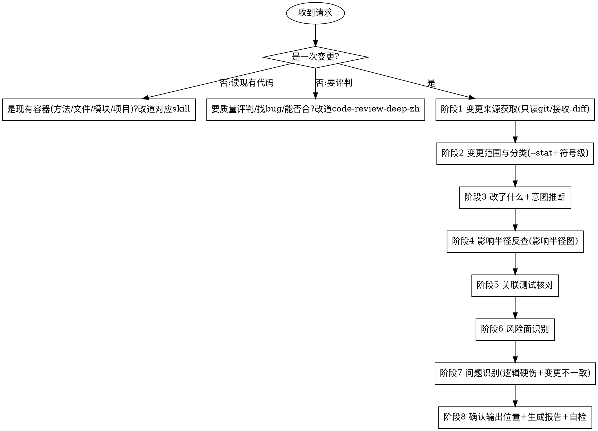

# 深度代码阅读 · 变更阅读 (code-read-deep-change)

从用户给出的**一次变更**（git diff / git show / commit 范围 A..B / PR / 用户直接给的 `.diff` 文本）出发，**只读不改**地读懂这次变更：
获取变更 → 摸清范围 → 说清改了什么 → 推断意图 → 反查影响半径 → 核对关联测试 → 诚实摊开风险面 → 顺手记录明显问题，
最后产出一份**结构化、规范化**的中文变更阅读报告，内含一张 **Mermaid** 影响半径图。

报告遵循固定的 8 段结构：**变更范围 → 改了什么 → 意图推断 → 影响半径 → 关联测试 → 风险面 → 问题 → 建议下一步**。

> 定位是**理解变更**（改了什么 / 为什么 / 波及谁 / 有哪些风险点）；**不是**质量评判（好不好 / 安不安全 / 该不该合 → `code-review-deep-zh`）。

---

## 核心定位
- **变更驱动**：分析对象是"一次变更"（一段 diff / 一个 commit / 一个范围 / 一个 PR），不是某一个现有的方法/文件/模块/项目。
- **影响半径优先**：核心价值在于把被改符号的**调用方/消费方/下游契约**反查出来，标清"谁需要跟着改"。
- **理解而非评判**：答"改了什么 / 为什么 / 波及谁 / 有哪些风险点"；不给变更打质量分、不判断该不该合（那是 `code-review-deep-zh`）。
- **诚实标风险与遗漏**：行为变化、可能漏改的调用方/测试/文档，显式摊开，不假装"改得很完整"。
- **只读不改**：不改 diff、不改代码、不提交；**阅读导向非质量审查**（问题只报逻辑/流程硬伤 + 变更相关不一致）。
- **多语言**：按各生态识别被改符号与其调用点（Java/Kotlin/Python/JS/TS/Go/C#）。

---

## 硬性前置：必须是「一次变更」

> 先判定，再做其他任何事。

**只接受一次变更作为分析对象**：工作区改动（`git diff`）、暂存区（`git diff --cached`）、提交范围（`git diff A..B` / `git log A..B`）、单个 commit（`git show <sha>`）、PR（`gh pr diff <n>`）、或用户直接给的 `.diff`/`.patch` 文本。

以下输入**不走本 skill**：
- 读**现有代码**的单个方法入口 `类名.方法名` → `code-read-deep-function`。
- 读现有的**单个文件** → `code-read-deep-file`。
- 读现有的**单个模块/目录/包** → `code-read-deep-module`。
- 读现有的**整个项目/仓库** → `code-read-deep-project`。
- **质量/安全/性能审查、给变更打分、判断该不该合/有没有 bug**（即便对象是 PR/diff）→ `code-review-deep-zh`。
  - 标准回应：
    > 你给的是<一个现有方法/文件/模块/项目>，想读懂这个容器请用 `code-read-deep-<function/file/module/project>`。
    > 若你想**评判这次变更好不好 / 有没有 bug 或安全问题 / 该不该合**，请用 `code-review-deep-zh`。
    > 若你想**读懂一次变更改了什么、波及谁、有哪些风险点**（理解，不评判），把 diff / commit / PR 给我即可。

> 区别要点：容器 skill 答"这个现有的东西内部是什么/怎么组织"；本 skill 答"这次变更动了什么、波及哪里"；review 答"这次变更好不好/能不能合"。

---

## 何时使用 / 何时不用

**使用本 skill：**
- 想知道某个 **PR / commit / 一段 diff** 改了什么、为什么这么改。
- 想知道这次改动的**影响半径**：被改符号波及哪些上下游、有没有漏改的调用方。
- 想知道签名/返回/契约变化的下游**是否需要同步改**、新增依赖**是否已装配**、被删符号**是否仍被引用**。
- 想把一次变更的改动与波及范围**讲清楚**（理解导向）。

**不要用本 skill（改走对应能力）：**
- 读现有代码的单个方法/文件/模块/项目 → 对应的 `code-read-deep-*` 容器 skill。
- 质量/安全/性能审查、给变更打分、判断该不该合/找 bug（即便对象是 PR/diff）→ `code-review-deep-zh`。
- 加注释 → `code-annotating`；一句话解释 → `/explain`；调 bug → systematic-debugging；写新功能 → code-vibe-workflow。

---

## 工作流程

按顺序执行，不要跳阶段。详细规则按需加载 `references/change-rules.md`；
> 必要时加载 `references/reading-lenses.md`——尤其"**git 历史**"视角推断意图、"**测试即规格**"视角判断关联测试（"框架感知/运行期"在反查 DI 装配、动态分发的影响时也有用）。

各阶段要点见 `references/change-rules.md`：① 变更来源获取（只读 git / 接收 `.diff`，含闸门判定）；② 变更范围与分类（`--stat` 列文件 + 落到符号级，标签名/返回/异常是否变）；③ 改了什么（说实质改动，不逐行念 diff）+ 意图推断（commit message / PR / git 历史）；④ 影响半径（对每个对外/高风险被改符号全库反查调用方，盯签名/契约变化的下游是否需同步改、新依赖是否装配、被删符号是否仍被引用，深挖委派）；⑤ 关联测试（测试即规格，哪些需更新/缺失）；⑥ 风险面（行为变化点、边界/兼容性、可能遗漏路径、未同步更新）。
**阶段 7**：按 `references/problem-checklist.md` 仅记录逻辑/流程硬伤 + 变更相关不一致。
**阶段 8**：先由用户指定输出位置/文件名（默认建议 `docs/code-read-deep-change/<变更标识>-YYYYMMDD.md`，也可仅对话输出），按 `references/report-template.md` 生成 8 段 + 一张图，过自检后交付。

---

## 报告结构（8 段）
完整模板见 `references/report-template.md`：**变更范围（--stat+符号级）/ 改了什么（实质改动）/ 意图推断（带证据来源）/ 影响半径（＋影响半径图）/ 关联测试 / 风险面 / 问题 / 建议下一步**。

## 一张 Mermaid 图
- **影响半径图**（`flowchart LR`）：中心 = 被改符号，四周 = 受影响的调用方/消费方/下游契约；在边或节点上标注「签名变更 / 已删除 / 新增依赖未装配 / 依赖新增 setter」等。

## 规范化自检（交付前必过）
- [ ] 8 段齐全、顺序正确；影响半径图存在可渲染。
- [ ] 「变更范围」落到**符号级**（哪些类/方法/字段被增删改、签名/返回/异常是否变），不只列文件。
- [ ] 「影响半径」对每个对外/高风险被改符号都反查了调用方，明确"是否需同步改"；未反查处标「未逐一反查」。
- [ ] 「意图推断」证据不足处标「推断」，未把猜测写成结论。
- [ ] 「风险面」摊开行为变化与可能漏改的调用方/测试/文档，未假装"改得很完整"。
- [ ] 深挖某受影响容器附"向下委派"，沿某线索追到底附"委派 trace"，未在本报告展开容器内部或追穿整条链。
- [ ] 问题分级规范（🔴/🟡/🔵 + 证据 + 影响），仅逻辑硬伤 + 变更相关不一致；**未做质量评分**。
- [ ] 聚焦"这一次变更"，未发散成"读某个现有容器"或"给变更打分"。
- [ ] 中文表述，术语一致；位置引用为 `相对路径:行号`。

---

## 与其他能力的边界
| 能力 | 它做什么 | 与本 skill 的区别 |
|------|---------|------------------|
| `code-read-deep-function/file/module/project` | 读"一个**现有**容器"内部 | 本 skill 读"一次**变更**"；深挖某受影响调用方/容器委派给它们 |
| `code-read-deep-trace` | 沿一条横切线索跨容器追踪 | 本 skill 读一次变更；沿某条**受影响线索**追到底委派给它 |
| `code-review-deep-zh` | 10 维度质量审查（好不好/安不安全/该不该合） | 本 skill 只**理解变更**（改了什么/为什么/波及谁/风险点），不评判、不打分 |
| `/explain` | 解释一小段代码 | 本 skill 读整次变更、反查影响半径、出图 |
| `code-annotating` | 加注释（改文件） | 本 skill 不改码、产报告 |

## 增量更新与阅读索引（可选）

- **增量更新**：若用户指定的输出位置已存在上一版报告，先读旧报告、对比当前代码变化做**增量更新**（显式标注「新增 / 变化 / 移除」），而非从零重写。
- **阅读索引**：可在 `docs/code-read-deep/INDEX.md` 累积「已读清单」（粒度 ｜ 对象 ｜ 报告路径 ｜ 日期），让重复阅读沉淀为项目知识；首次写入时创建该文件。

---

## 常见错误
- **把理解做成评判**：用户要"读懂这次改了啥/波及谁"，却去给变更打质量分、判断能不能合 —— 错，那是 `code-review-deep-zh`。
- **只列文件不落符号**：变更范围停在文件级，没说哪些方法/签名/字段变了 —— 错。
- **漏反查影响半径**：被改的是对外符号却不查调用方，错过"调用方需同步改" —— 错，这是本 skill 的重心。
- **把猜测当结论**：意图推断没有证据还写得言之凿凿 —— 错，证据不足要标「推断」。
- **假装改得很完整**：明明 diff 漏改了调用点/装配/测试却不在风险面摊开 —— 错。
- **容器误吃**：给的是"读某个现有方法/文件/模块/项目"还硬当变更读 —— 错，改道对应容器 skill。
- **越权改码 / 越界报问题 / 自作主张存盘**：同家族 —— 错。
