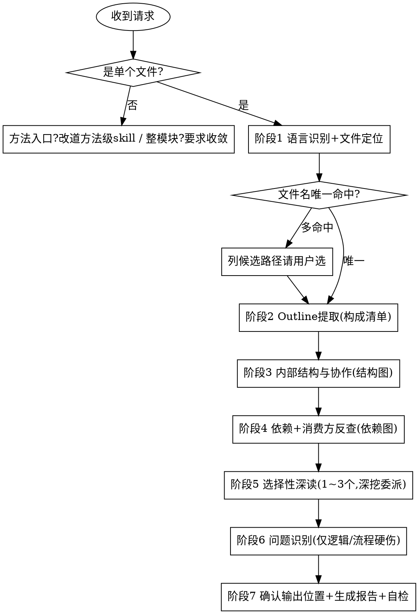
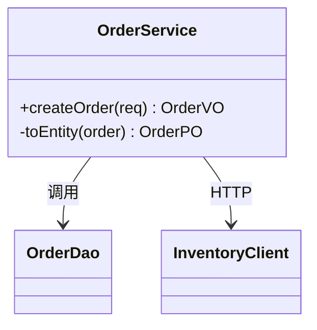
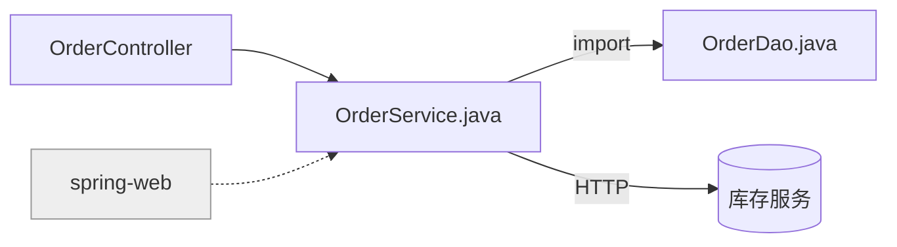

# 深度代码阅读 · 文件级 (code-read-deep-file)

从用户明确给出的**单个源文件**出发，**只读不改**地把这个文件读透：
识别语言 → 列全文件里有什么（Outline 地图）→ 看内部怎么协作 → 反查它依赖谁、被谁用 →
挑 1~3 个关键成员选择性深读 → 顺手记录明显的逻辑/流程硬伤，最后产出一份**结构化、规范化**的中文阅读报告，内含两张 **Mermaid** 图。

报告遵循固定的 9 段结构：**定位 → 职责概述 → 构成清单 → 对外接口 → 内部结构与协作 → 依赖与消费方 → 关键数据与状态 → 重点方法选读 → 问题**。

> 与方法级 `code-read-deep-function` 是**兄弟 skill**，形成 **文件 → 方法** 的缩放层级：
> 本 skill 给"全景地图 + 结构/依赖图 + 选择性深读"，谁要深挖某个方法的完整调用链/数据流，改用 `code-read-deep-function`。

---

## 核心定位

- **文件驱动**：分析对象永远是"一个源文件"，不是一个方法、一个模块、一个项目。
- **地图优先，不逐方法深挖**：先铺开全文件全景，再选择性下钻 1~3 个关键成员；其余只在 Outline 里一句话带过。
- **只读不改**：全程不编辑任何业务代码，只产出报告（符合仓库与全局规则）。
- **阅读导向，不是质量审查**：问题部分只报"读代码时顺手可见的逻辑/流程硬伤"，不做安全/性能/规范的全维度审查（那是 `code-review-deep-zh`）。
- **多语言**：先识别语言，再按该语言习惯解析构件与依赖。注意 Python/JS/TS/Go 一个文件常含**多个类与多个顶层函数**。

---

## 硬性前置：必须是「单个文件」

> 这是本 skill 能否启动的闸门，先判定，再做其他任何事。

**只接受单个源文件。** 输入形态：相对/绝对路径（`src/order/OrderService.java`）或文件名（`OrderService.java`）。

以下输入**不走本 skill**：

- 给了**单个方法入口 `类名.方法名`**（如 `OrderService.createOrder`），或想深挖某方法的调用链/数据流。
  - 标准回应：
    > 你给的是单个方法入口，深挖某个方法的调用链/数据流请用 `code-read-deep-function`（读 `类名.方法名`）。
    > 如果你想读懂的是整个文件，请告诉我文件名/路径，例如 `OrderService.java`。
- 要读**整个模块 / 整个目录 / 整个项目 / 全代码库**。
  - 标准回应：
    > 本 skill 只针对**单个文件**通读。请告诉我具体要读哪个文件（路径或文件名），例如 `OrderService.java`。
    > （整模块 / 整目录 / 整项目的通读不在本 skill 范围内。）

> 文件名多处命中时，**列出候选路径让用户选**，不擅自挑（详见 `references/file-mapping-rules.md`）。

---

## 何时使用 / 何时不用

**使用本 skill：**
- 用户给出了**单个文件**（路径/文件名），想读懂/梳理这整个文件。
- 用户想要这个文件的**结构图**或**依赖关系图**。
- 用户想知道文件里**有哪些类/函数**及其职责（要一张 Outline 地图）。
- 用户想知道这个文件**依赖谁（上游）**、**被谁用（下游消费方）**。

**不要用本 skill（改走对应能力）：**
- 给的是单个方法入口 `类名.方法名`、要深挖某方法 → `code-read-deep-function`。
- 要读整个模块/目录/项目 → **不适用**，先要求收敛到单个文件。
- 代码质量审查、安全审计、性能审查、合并前审查 → `code-review-deep-zh`。
- 只是给代码加注释 → `code-annotating`。
- 只要一句话解释一小段代码、不需要图和清单 → `/explain` 命令。
- 调试排查具体 bug → systematic-debugging。
- 编写新功能/新代码 → code-vibe-workflow。

---

## 工作流程

按顺序执行，不要跳阶段。详细规则按需加载对应 `references/` 文件。
> 必要时加载 `references/reading-lenses.md`——测试即规格 / git 历史 / 运行期证据 / 框架感知 四个补充阅读视角；用了哪个就在报告相应段落注明证据来源。



### 阶段 1：语言识别 + 文件定位
1. **闸门检查**：确认输入是单个文件；是方法入口则改道 `code-read-deep-function`，是整模块/项目则要求收敛。
2. **识别语言**：按扩展名判定（`.java`/`.kt`/`.py`/`.ts`/`.go`/`.cs` …）。
3. **定位文件**：给路径直接 Read；只给文件名用 Glob 找 `**/<文件名>`，多命中列候选让用户选；记录总行数 LOC。
4. 详见 `references/file-mapping-rules.md`（语言识别 + 文件定位）。

### 阶段 2：Outline 提取（构成清单）—— 文件级地图核心
扫描全文件，枚举**所有顶层构件**（类/接口/枚举/顶层函数/导出常量），每项记 kind + 可见性 + `file:line` + 一句话定位。
- **只列不展开**：此阶段不追调用链、不贴代码；大文件尤其克制。
- 有类的语言按"类 → 其方法"分组；无类语言按"导出/内部函数 + 常量"分组。
- 详见 `references/file-mapping-rules.md`（Outline 提取规则）。
- 产出：构成清单 →「构成清单 Outline」段。

### 阶段 3：内部结构与协作（→ ① 结构图）
梳理文件**内部**各构件如何协作：公共方法→私有 helper、类间持有/继承/实现、找出主干。
- 剪枝：trivial（getter/setter/toString/日志）不进图；跨文件依赖留给阶段 4。
- 产出：文件内结构关系 → ① 结构图（OO 用 `classDiagram`，无类语言用 `flowchart`）。

### 阶段 4：依赖与消费方反查（→ ② 依赖关系图）
- **上游**：解析 import/using/require，列出本文件依赖的内部文件与第三方；外部 IO（DB/HTTP/MQ/缓存/文件）单列。
- **下游**：全库 Grep 谁 import/引用本文件的导出符号；框架反射/注解入口（路由/定时/监听）按注解判断"由框架调用"；测试消费方单独标注。
- 详见 `references/file-mapping-rules.md`（依赖反查 / 消费方反查）。
- 产出：上游+下游 → ② 依赖关系图。

### 阶段 5：选择性深读（1~3 个关键成员，深挖委派）
挑**最多 3 个**最值得读的成员做**中等深度**详读（优先级：用户点名 > 对外 API 入口 > 业务主干 > 复杂度最高）。
- 讲清职责、关键分支/状态、在文件内的协作、触达的外部 IO。
- **止于本文件**：完整调用链/数据流不在这里展开，每个成员附"深挖 → `code-read-deep-function` `类名.方法名`"。
- 详见 `references/file-mapping-rules.md`（选择性深读的挑选标准）。

### 阶段 6：问题识别（仅逻辑 / 流程硬伤）
通读过程中顺手记录**明显**的逻辑/流程问题，分三级（🔴 阻断 / 🟡 建议 / 🔵 提示），每条带 `file:line` + 证据 + 一句话影响。
- 范围**严格限定**为逻辑/流程硬伤（空指针、未处理异常、空 catch、死循环、不可达死分支、资源未释放、并发竞态、返回值被忽略等）。
- **不**做安全/性能/规范的全维度审查——那是 `code-review-deep-zh`。
- 判定清单见 `references/problem-checklist.md`。

### 阶段 7：报告生成（输出位置由用户指定 + 规范化自检）
1. **先确认输出位置与文件名**——由用户指定，不自作主张：
   - 询问报告写到哪个目录、用什么文件名；
   - 用户未指定时，给出**建议默认**（如 `docs/code-read-deep-file/<文件名>-YYYYMMDD.md`）并请其确认；
   - 用户也可选择**仅在对话中输出、不落文件**。
2. 按 `references/report-template.md` 的 9 段结构 + 格式规范生成 Markdown（含两张 Mermaid 图）。
3. **规范化自检**（见下）后再交付/写文件。

---

## 报告结构（9 段）

完整模板与格式规范见 `references/report-template.md`。九段固定顺序：

1. **定位** —— 文件 `相对路径`、语言、LOC、包/命名空间、系统分层角色、文件类型（含几个类/几个顶层函数）。
2. **职责概述** —— 文件整体职责一句话，是否单一职责（混杂则点出，仅提示不做架构评审）。
3. **构成清单 Outline** —— 表格列全文件内所有构件（kind/可见性/`file:line`/一句话定位），按类分组。
4. **对外接口 Public API** —— 导出/公共面（消费方契约）vs 内部 helper。
5. **内部结构与协作** —— 内嵌 **① 结构图**（Mermaid）。
6. **依赖与消费方** —— 上游依赖 + 下游消费方；内嵌 **② 依赖关系图**（Mermaid）。
7. **关键数据与状态** —— 核心数据结构/类型、关键字段/模块级状态。
8. **重点方法选读** —— 1~3 个关键成员中等深度详读，每个附"深挖→`code-read-deep-function`"。
9. **问题** —— 明显逻辑/流程硬伤清单（分级 + `file:line` + 证据 + 影响）。

---

## 两张 Mermaid 图的写法约定

> 全部用 Mermaid 代码块（```mermaid），保证可在 Markdown/GitHub/IDE 直接渲染。

**① 结构图**（文件内部结构）：OO 语言用 `classDiagram`，无类语言用 `flowchart`。
- 展示文件内的类/成员与它们的协作关系；trivial 成员不入图。



**② 依赖关系图**（文件级依赖）：用 `flowchart LR`。
- 中心节点是**本文件**；左侧是下游消费方，右侧是上游依赖与外部系统；第三方用不同样式区分。



---

## 规范化自检（交付前必过）

生成报告后，对照以下清单逐项确认，不达标就修正：

- [ ] 9 段标题齐全、顺序正确、层级一致（`##` 段标题、`###` 子项）。
- [ ] 两张 Mermaid 图均存在且语法可渲染（节点/边闭合，无非法字符）。
- [ ] 「构成清单 Outline」**覆盖文件内全部顶层构件**，无遗漏（漏列要声明）。
- [ ] 所有"代码摘录"和"问题"条目都带 `file:line`，用相对路径。
- [ ] 「重点方法选读」**不超过 3 个**，每个都附"深挖 → `code-read-deep-function`"委派标注。
- [ ] 问题分级用统一标记（🔴 阻断 / 🟡 建议 / 🔵 提示），每条含证据 + 影响，且只报逻辑/流程硬伤。
- [ ] 报告聚焦于**这一个文件**，未扩散成整模块/整项目通读，也未退化成逐方法深挖。
- [ ] 中文表述，术语前后一致；剪枝/省略处已注明边界。

---

## 与其他能力的边界（避免重叠）

| 能力 | 它做什么 | 与本 skill 的区别 |
|------|---------|------------------|
| `code-read-deep-function`（skill） | 从单个方法入口深挖完整调用链/数据流 | 本 skill 读**整个文件**给地图，深挖委派给它 |
| `/explain`（命令） | 纯文本解释一小段代码 | 本 skill 出图、列全文件清单、结构化报告 |
| `code-annotating` | 给代码加注释（会改文件） | 本 skill 不改码、产报告 |
| `code-review-deep-zh` | 10 维度深度质量审查 | 本 skill 是阅读理解、不做全维度审查 |

---

## 增量更新与阅读索引（可选）

- **增量更新**：若用户指定的输出位置已存在上一版报告，先读旧报告、对比当前代码变化做**增量更新**（显式标注「新增 / 变化 / 移除」），而非从零重写。
- **阅读索引**：可在 `docs/code-read-deep/INDEX.md` 累积「已读清单」（粒度 ｜ 对象 ｜ 报告路径 ｜ 日期），让重复阅读沉淀为项目知识；首次写入时创建该文件。

---

## 常见错误

- **越界通读**：把"读一个模块/一个目录/一个项目"当成本 skill 的活 —— 错。必须是单个文件，否则不适用。
- **退化成逐方法深挖**：对文件里每个方法都跑一遍完整调用链 —— 错。只选 1~3 个深读，其余进 Outline，深挖委派方法级 skill。
- **Outline 漏列**：只列"主类"、漏掉文件里其他类/顶层函数 —— 错。清单必须覆盖全文件构件。
- **越权改码**：边读边改/重构/加注释 —— 错。本 skill 只读不改。
- **越界报问题**：把安全/性能/风格都报进去 —— 错。只报逻辑/流程硬伤，其余交 `code-review-deep-zh`。
- **自作主张存盘**：不问用户就把报告写到某处 —— 错。输出位置与文件名由用户指定。
- **方法入口误吃**：用户给的是 `类名.方法名` 还硬当文件读 —— 错。改道 `code-read-deep-function`。
