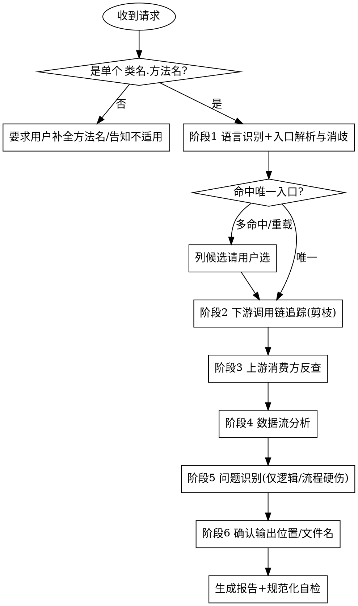
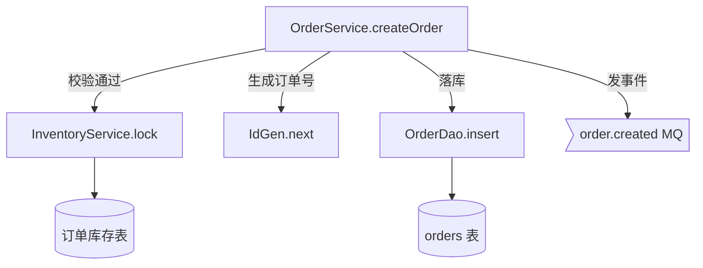
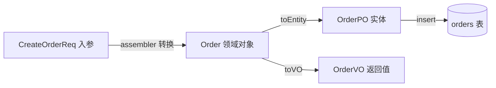

# 深度代码阅读 (code-read-deep-function)

从用户明确给出的**单个方法入口**（`类名.方法名`）出发，**只读不改**地把这个方法读透：
识别语言 → 追踪它往下调用了谁（下游调用链）→ 反查它被谁调用（上游消费方）→ 跟踪数据怎么流 →
顺手记录明显的逻辑/流程硬伤，最后产出一份**结构化、规范化**的中文阅读报告，内含两张 **Mermaid** 图。

报告遵循固定的 8 段结构（来自用户的阅读法）：**定位 → 概念 → 流程 → 算法 → 数据流转 → 代码摘录 → 问题 → 上下游消费方**。

---

## 核心定位

- **入口驱动**：分析对象永远是"一个方法"，不是一个类、一个文件、一个项目。
- **只读不改**：全程不编辑任何业务代码，只产出报告（符合仓库与全局规则）。
- **阅读导向，不是质量审查**：问题部分只报"读代码时顺手可见的逻辑/流程硬伤"，不做安全/性能/规范的全维度审查（那是 `code-review-deep-zh`）。
- **多语言**：先识别语言，再按该语言习惯解析入口与追踪调用。

---

## 硬性前置：必须是「类名.方法名」

> 这是本 skill 能否启动的闸门，先判定，再做其他任何事。

**只接受单个方法入口。** 规范形态 `类名.方法名`（如 `OrderService.createOrder`）。

以下输入**不走本 skill**，必须先要求用户补全到具体方法，补不全就明确告知"此请求不适用 code-read-deep-function"：

- 只给了**类名**（"读一下 OrderService"）、只给了**文件名**、只给了**模块/包名**。
- 要求读**整个类**、**整个文件**、**整个模块**、**整个项目 / 全代码库**。
- 笼统的"帮我看看这个项目 / 这块代码 / 这个目录是干嘛的"。

处理方式（缺方法名时的标准回应）：

> 本 skill 只针对单个方法入口梳理（`类名.方法名`）。请告诉我具体要读哪个方法，例如 `OrderService.createOrder`。
> （整类 / 整文件 / 整项目的通读不在本 skill 范围内。）

**多语言下的入口形态**（核心要求不变：必须定位到"一个具体函数/方法"，不是整体）：

| 语言 | 入口形态 | 示例 |
|------|---------|------|
| Java / Kotlin / C# / Scala | `类名.方法名` | `OrderService.createOrder` |
| Python | `类.方法` 或 `模块.函数` | `OrderService.create_order` / `orders.create_order` |
| JS / TS | `类.方法` 或 `模块.导出函数` | `OrderService.create` / `orderApi.submit` |
| Go | `(接收者).方法` 或 `包.函数` | `(*OrderService).Create` / `order.Create` |

> 注意：即便是无类语言，也必须落到**单个具体函数**；"读整个文件/包"同样不适用。

---

## 何时使用 / 何时不用

**使用本 skill：**
- 用户给出了 `类名.方法名`，想梳理它的调用关系 / 逻辑 / 数据流。
- 用户想要这个方法的**调用图**或**数据流转图**。
- 用户想知道这个入口**被谁调用（上游）**、**又调用了谁（下游）**。
- 用户想"读懂"某个具体方法在系统里怎么走。

**不要用本 skill（改走对应能力）：**
- 只给类名/文件/模块，或要读整个类/项目 → **不适用**，先要求补全到 `类名.方法名`。
- 代码质量审查、安全审计、性能审查、合并前审查 → `code-review-deep-zh`。
- 只是给代码加注释 → `code-annotating`。
- 只要一句话解释一小段代码、不需要图和调用链 → `/explain` 命令。
- 调试排查具体 bug → 走 systematic-debugging。
- 编写新功能/新代码 → 走 code-vibe-workflow。

---

## 工作流程

按顺序执行，不要跳阶段。详细规则按需加载对应 `references/` 文件。
> 必要时加载 `references/reading-lenses.md`——测试即规格 / git 历史 / 运行期证据 / 框架感知 四个补充阅读视角；用了哪个就在报告相应段落注明证据来源。



### 阶段 1：语言识别 + 入口解析与消歧
1. **闸门检查**：确认输入是单个 `类名.方法名`；否则按上文标准回应终止。
2. **识别语言**：按项目文件/扩展名判定（`.java`/`.kt`/`.py`/`.ts`/`.go`/`.cs` …）。
3. **定位入口**：用 Glob 找类/模块文件，用 Grep 在文件内定位方法定义，记录 `file:line` 与完整签名。
4. **消歧**：若同名类多处存在，或方法存在重载（多签名），**列出候选（含包名/参数签名）让用户选**，不擅自猜。
   - 详见 `references/tracing-rules.md`（入口解析与消歧）。

### 阶段 2：下游调用链追踪（带剪枝）
从入口方法体出发，解析它调用的方法/函数，按剪枝规则递归向下。
- **必须剪枝**（否则指数膨胀）：限最大深度、跳过标准库与第三方目录（`node_modules`/`site-packages`/`vendor`/JDK 等）、跳过 getter/setter/toString/日志等 trivial 调用、接口→定位实现、用已访问集合检测并切断递归环。
- 详见 `references/tracing-rules.md`（调用追踪与剪枝）。
- 产出：下游调用树（用于 ① 逻辑调用图）。

### 阶段 3：上游消费方反查
全库反查"谁调用了这个入口方法"。
- 用 Grep 搜方法名，再用类型/接收者/导入约束去掉同名误报（按语言适配）。
- 产出：上游调用方列表（用于 上下游关系图）。

### 阶段 4：数据流分析
沿下游调用链跟踪数据：
- **入参 → 返回值**在链路中的流动与变形；
- **DTO / VO / 实体跨层转换**点（如 Controller DTO → Service 领域对象 → DAO 实体）；
- **外部 IO**读写点（DB / HTTP / MQ / 缓存 / 文件）。
- 产出：数据流图数据（用于 ② 数据流转图）。

### 阶段 5：问题识别（仅逻辑 / 流程硬伤）
阅读过程中顺手记录**明显**的逻辑/流程问题，分三级（🔴 阻断 / 🟡 建议 / 🔵 提示），每条带 `file:line` + 证据 + 一句话影响。
- 范围**严格限定**为逻辑/流程硬伤（空指针、未处理异常、空 catch、死循环/无限递归、不可达死分支、资源未释放、并发竞态、返回值被忽略等）。
- **不**做安全/性能/规范的全维度审查——那是 `code-review-deep-zh`。
- 判定清单见 `references/problem-checklist.md`。

### 阶段 6：报告生成（输出位置由用户指定 + 规范化自检）
1. **先确认输出位置与文件名**——由用户指定，不自作主张：
   - 询问用户报告写到哪个目录、用什么文件名；
   - 用户未指定时，给出**建议默认**（如 `docs/code-read-deep-function/<类名>.<方法名>-YYYYMMDD.md`）并请其确认；
   - 用户也可选择**仅在对话中输出、不落文件**。
2. 按 `references/report-template.md` 的 8 段结构 + 格式规范生成 Markdown（含两张 Mermaid 图）。
3. **规范化自检**（见下）后再交付/写文件。

---

## 报告结构（8 段）

完整模板与格式规范见 `references/report-template.md`。八段固定顺序：

1. **定位** —— 入口 `file:line`、语言、包/类/方法签名、消歧结果、在系统分层中的角色。
2. **概念** —— 业务/领域含义、该方法一句话职责。
3. **流程** —— 步骤化执行流；内嵌 **① 逻辑调用图**（Mermaid）。
4. **算法** —— 核心算法、关键分支/循环/状态、重要前置后置条件。
5. **数据流转** —— 内嵌 **② 数据流转图**（Mermaid）：入参/返回值流 + DTO 跨层 + 外部 IO。
6. **代码摘录** —— 关键片段（`file:line`）+ 一句话简注，不贴大段。
7. **问题** —— 明显逻辑/流程硬伤清单（分级 + `file:line` + 证据 + 影响）。
8. **上下游消费方** —— 上游：谁调用此入口；下游：此入口调用/依赖谁（含外部系统）；附上下游关系图。

---

## 两张 Mermaid 图的写法约定

> 全部用 Mermaid 代码块（```mermaid），保证可在 Markdown/GitHub/IDE 直接渲染。

**① 逻辑调用图**（流程/调用树）：用 `flowchart TD`。
- 节点文案统一 `类名.方法名`；边上用文字标注触发分支/条件。
- 外部系统（DB/HTTP/MQ）节点用不同形状/样式区分（如 `[(DB)]`、`>MQ]`）。



**② 数据流转图**（数据形态变化）：用 `flowchart LR`。
- 节点是**数据**（入参、DTO、领域对象、实体、返回值、外部存储），边是**转换/读写动作**。



---

## 规范化自检（交付前必过）

生成报告后，对照以下清单逐项确认，不达标就修正：

- [ ] 8 段标题齐全、顺序正确、层级一致（`##` 段标题、`###` 子项）。
- [ ] 两张 Mermaid 图均存在且语法可渲染（节点/边闭合，无非法字符）。
- [ ] 所有"代码摘录"和"问题"条目都带 `file:line`。
- [ ] 问题分级用统一标记（🔴 阻断 / 🟡 建议 / 🔵 提示），每条含证据 + 影响。
- [ ] 报告聚焦于**这一个入口方法**，未扩散成整类/整项目通读。
- [ ] 中文表述，术语前后一致；剪枝处已注明"已省略/未展开"边界。

---

## 与其他能力的边界（避免重叠）

| 能力 | 它做什么 | 与本 skill 的区别 |
|------|---------|------------------|
| `/explain`（命令） | 纯文本解释一小段代码 | 本 skill 出图、跨调用链、结构化报告 |
| `code-annotating` | 给代码加注释（会改文件） | 本 skill 不改码、产报告 |
| `code-reviewer`（agent） | 审最近改动、5 维度 | 本 skill 从指定入口读全链路、只报逻辑硬伤 |
| `code-review-deep-zh` | 10 维度深度质量审查 | 本 skill 是阅读理解、不做全维度审查 |

---

## 增量更新与阅读索引（可选）

- **增量更新**：若用户指定的输出位置已存在上一版报告，先读旧报告、对比当前代码变化做**增量更新**（显式标注「新增 / 变化 / 移除」），而非从零重写。
- **阅读索引**：可在 `docs/code-read-deep/INDEX.md` 累积「已读清单」（粒度 ｜ 对象 ｜ 报告路径 ｜ 日期），让重复阅读沉淀为项目知识；首次写入时创建该文件。

---

## 常见错误

- **越界通读**：把"读一个类/一个项目"当成本 skill 的活 —— 错。必须是单个 `类名.方法名`，否则不适用。
- **不剪枝**：把整条调用链无限展开 —— 错。按剪枝规则收敛，注明省略边界。
- **越权改码**：边读边改/重构/加注释 —— 错。本 skill 只读不改。
- **越界报问题**：把安全/性能/风格都报进去 —— 错。只报逻辑/流程硬伤，其余交 `code-review-deep-zh`。
- **自作主张存盘**：不问用户就把报告写到某处 —— 错。输出位置与文件名由用户指定。
- **消歧靠猜**：方法重载或同名类时直接挑一个 —— 错。列候选让用户选。
