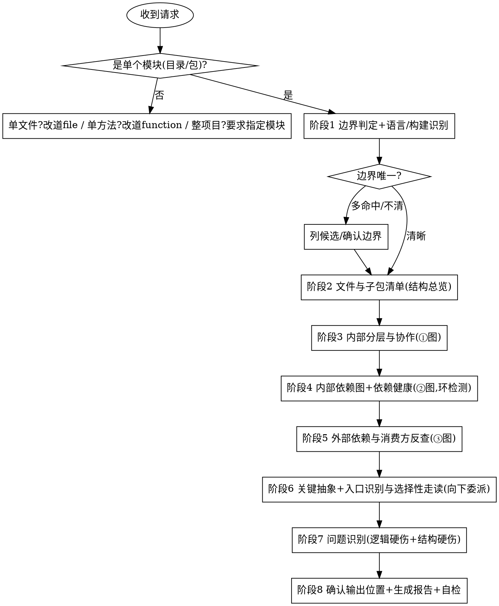
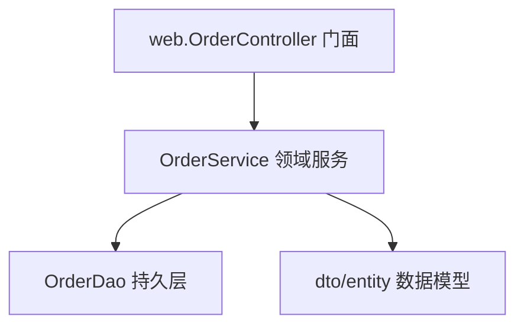
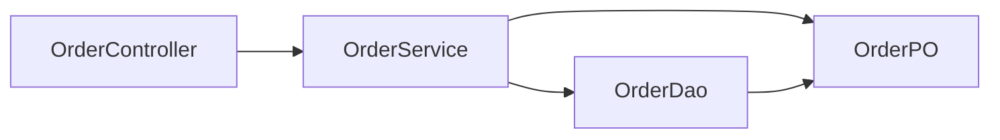
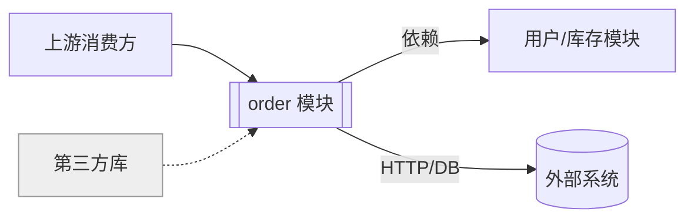

# 深度代码阅读 · 模块级 (code-read-deep-module)

从用户明确给出的**单个模块（目录 / 包子树）**出发，**只读不改**地把这个模块读透：
识别语言/构建与模块边界 → 列全模块里有哪些文件/子包（结构地图）→ 看内部分层怎么协作 →
画内部依赖图并做依赖健康体检（环/分层破坏）→ 反查模块依赖谁、被谁用 →
从入口选择性走读 1~3 条关键路径 → 顺手记录明显的逻辑/流程硬伤与结构硬伤，
最后产出一份**结构化、规范化**的中文阅读报告，内含三张 **Mermaid** 图。

报告遵循固定的 10 段结构：**定位 → 职责概述 → 结构总览 → 对外门面 → 内部分层与协作 → 内部依赖与依赖健康 → 外部依赖与消费方 → 关键抽象与数据模型 → 入口与关键路径选读 → 问题**。

> 与 `code-read-deep-file`（文件级）、`code-read-deep-function`（方法级）是**同一家族**，形成 **模块 → 文件 → 方法** 三级缩放：
> 本 skill 给"全模块地图 + 三张图 + 关键路径走读"，想读整个文件改用 `code-read-deep-file`，想深挖某方法改用 `code-read-deep-function`。

---

## 核心定位

- **模块驱动**：分析对象永远是"一个模块（目录/包子树）"，不是一个文件、一个方法、一个完整项目。
- **地图优先，不逐文件深挖**：先铺开全模块地图与依赖图，再从入口选择性走读 1~3 条路径；单文件/单方法的深读向下委派。
- **依赖与分层是重心**：模块级阅读的核心是**内部依赖图（含环检测）+ 分层 + 对外上下文**（业内 C4 Component/Context、DSM、包原则）。
- **只读不改**：全程不编辑任何业务代码，只产出报告（符合仓库与全局规则）。
- **阅读导向，不是质量审查**：问题部分只报逻辑/流程硬伤 + 明显的结构硬伤（依赖环/分层破坏），不做安全/性能/规范/架构取舍的全维度审查（那是 `code-review-deep-zh`）。
- **多语言**：先识别语言与构建系统，再按该生态判定模块边界与解析依赖。

---

## 硬性前置：必须是「一个模块（目录 / 包子树）」

> 这是本 skill 能否启动的闸门，先判定，再做其他任何事。

**只接受单个模块。** 输入形态：目录路径（`src/order`）或包/模块名（`com.example.order`、`payments`）。

以下输入**不走本 skill**：

- 给了**单个文件**（如 `OrderService.java`）。
  - 标准回应：
    > 你给的是单个文件，请用 `code-read-deep-file` 读整个文件。若想读的是它所在的整个模块，请告诉我模块目录/包，例如 `src/order`。
- 给了**单个方法入口 `类名.方法名`**（如 `OrderService.createOrder`）。
  - 标准回应：
    > 你给的是单个方法入口，深挖某方法的调用链/数据流请用 `code-read-deep-function`。若想读整个模块，请给我模块目录/包。
- 要通读**整个项目 / 全代码库**。
  - 标准回应：
    > 本 skill 一次只读**一个模块**。请指定要读哪个模块（目录或包），例如 `src/order`。
    > （若项目本身就是一个小模块，可直接给项目根目录。）

> 模块名解析到多个目录、或边界不清时，**列出候选/请用户确认边界**，不擅自猜（详见 `references/module-mapping-rules.md`）。

---

## 何时使用 / 何时不用

**使用本 skill：**
- 用户给出了**单个模块**（目录/包），想读懂/梳理这整个模块。
- 用户想要模块的**分层结构图 / 内部依赖图 / 上下文（外部依赖）图**。
- 用户想知道模块里**有哪些文件/子包**及其职责（要一张模块地图）。
- 用户想知道模块**依赖谁（上游）**、**被谁用（下游消费方）**，或**内部依赖有没有环**。

**不要用本 skill（改走对应能力）：**
- 给的是单个文件 → `code-read-deep-file`。
- 给的是单个方法入口 `类名.方法名` → `code-read-deep-function`。
- 要通读整个项目/全代码库 → **不适用**，先指定一个模块。
- 代码质量审查、安全审计、性能审查、合并前审查 → `code-review-deep-zh`。
- 只是给代码加注释 → `code-annotating`。
- 只要一句话解释一小段代码 → `/explain` 命令。
- 调试排查具体 bug → systematic-debugging。
- 编写新功能/新代码 → code-vibe-workflow。

---

## 工作流程

按顺序执行，不要跳阶段。详细规则按需加载对应 `references/` 文件。
> 必要时加载 `references/reading-lenses.md`——测试即规格 / git 历史 / 运行期证据 / 框架感知 四个补充阅读视角；用了哪个就在报告相应段落注明证据来源。



### 阶段 1：模块边界判定 + 语言/构建识别
1. **闸门检查**：确认输入是一个模块；单文件改道 `code-read-deep-file`，单方法改道 `code-read-deep-function`，整项目要求指定模块。
2. **识别语言与构建系统**：按生态判定（Maven/Gradle、pyproject、package.json、go.mod、.csproj…）。
3. **解析边界**：把目录/包名解析成目录子树；边界不清则列候选/请用户确认。模块根有 README/package-info/`__init__.py` 文档先读。
4. 详见 `references/module-mapping-rules.md`（模块边界判定 + 多语言识别）。

### 阶段 2：文件与子包清单（结构总览）—— 模块地图核心
枚举模块子树内文件与子包，给目录树 + 每个关键文件/子包一句话定位。
- **只列不展开**：不深读任一文件内部；想读某文件 → 委派 `code-read-deep-file`。
- 大模块按分层目录聚合，次要文件合并并标注"（其余 N 个未逐一展开）"。
- 详见 `references/module-mapping-rules.md`（文件与子包清单）。

### 阶段 3：内部分层与组件协作（→ ① 组件/分层结构图）
识别模块内分层（web→service→dao→model 等）与组件协作，找出主干。
- 剪枝：trivial（DTO getter/setter、纯工具）不进图；模块外依赖留给阶段 5。
- 产出 → ① 组件/分层结构图。

### 阶段 4：内部依赖图 + 依赖健康（→ ② 内部依赖图）
解析模块内 import，保留指向子树内的依赖，建文件/子包有向图。
- **依赖健康体检**：环检测（ADP）、分层破坏（低层反依赖高层）、稳定核心/易变边缘（可选）。
- 详见 `references/module-mapping-rules.md`（内部依赖图 + 依赖健康）。
- 产出 → ② 内部依赖图（环/破坏特殊标注）。

### 阶段 5：外部依赖与消费方反查（→ ③ 上下文/依赖关系图）
- **外部依赖（上游）**：import 中指向子树之外的——其他内部模块、第三方、外部系统（DB/HTTP/MQ/缓存/文件）。
- **消费方（下游）**：全库 Grep 谁 import/引用本模块门面；框架反射/注解入口注明"由框架调用"；测试单独标注。
- 产出 → ③ 上下文/依赖关系图。

### 阶段 6：关键抽象与数据模型 + 入口识别与选择性走读
1. 找模块**核心数据模型/实体/状态机**与关键抽象（门面/核心服务/接口）。
2. 识别**入口点**（门面/Controller/路由/main/DI 装配），从入口沿**最主要的 1~3 条端到端路径**中等深度走读。
3. **止于路径级**：每条路径附"读整个文件 → `code-read-deep-file`；深挖某方法 → `code-read-deep-function`"。
- 详见 `references/module-mapping-rules.md`（关键抽象 / 入口与选择性走读）。

### 阶段 7：问题识别（逻辑硬伤 + 结构硬伤）
通读过程中顺手记录**明显**问题，分三级（🔴/🟡/🔵），每条带位置 + 证据 + 一句话影响。
- 范围：逻辑/流程硬伤（空指针、空 catch、死循环、资源未释放…）**＋ 模块级结构硬伤**（依赖环、分层破坏、门面被绕过、定义却从不调用的写路径）。
- **不**做安全/性能/规范/架构取舍的全维度审查——那是 `code-review-deep-zh`。
- 判定清单见 `references/problem-checklist.md`。

### 阶段 8：报告生成（输出位置由用户指定 + 规范化自检）
1. **先确认输出位置与文件名**——由用户指定，不自作主张：
   - 询问报告写到哪个目录、用什么文件名；
   - 用户未指定时，给出**建议默认**（如 `docs/code-read-deep-module/<模块名>-YYYYMMDD.md`）并请其确认；
   - 用户也可选择**仅在对话中输出、不落文件**。
2. 按 `references/report-template.md` 的 10 段结构 + 格式规范生成 Markdown（含三张 Mermaid 图）。
3. **规范化自检**（见下）后再交付/写文件。

---

## 报告结构（10 段）

完整模板与格式规范见 `references/report-template.md`。十段固定顺序：

1. **定位** —— 模块根路径、语言/构建、规模（文件数/LOC/子包数）、C4 架构角色。
2. **职责概述** —— 模块整体职责、边界、是否单一职责/限界上下文。
3. **结构总览** —— 目录树 + 关键文件/子包一句话定位（模块地图）。
4. **对外门面** —— 模块对外暴露什么（门面/服务/端点/导出），消费方契约。
5. **内部分层与组件协作** —— 内嵌 **① 组件/分层结构图**。
6. **内部依赖与依赖健康** —— 内嵌 **② 内部依赖图**；环检测/分层破坏结论。
7. **外部依赖与消费方** —— 上游外部依赖 + 下游消费方；内嵌 **③ 上下文/依赖关系图**。
8. **关键抽象与数据模型** —— 核心领域类型/实体/状态机、关键抽象。
9. **入口与关键路径选读** —— 1~3 条端到端路径中等深度走读，每条附向下委派。
10. **问题** —— 逻辑/流程硬伤 + 模块级结构硬伤（分级 + 位置 + 证据 + 影响）。

---

## 三张 Mermaid 图的写法约定

> 全部用 Mermaid 代码块（```mermaid），保证可在 Markdown/GitHub/IDE 直接渲染。三张图各司其职，别混为一张。

**① 组件/分层结构图**（模块内部分层协作）：用 `flowchart TD`（或 `classDiagram`）。



**② 内部依赖图**（模块内文件/子包依赖 + 健康）：用 `flowchart LR`。环与分层破坏特殊标注。



**③ 上下文/依赖关系图**（模块对外）：用 `flowchart LR`。左侧消费方 → 本模块 → 右侧外部依赖/系统。



---

## 规范化自检（交付前必过）

生成报告后，对照以下清单逐项确认，不达标就修正：

- [ ] 10 段标题齐全、顺序正确、层级一致（`##` 段标题、`###` 子项）。
- [ ] 三张 Mermaid 图均存在且语法可渲染（节点/边闭合，无非法字符），各司其职不重复。
- [ ] 「结构总览」**覆盖模块内全部关键文件/子包**，无遗漏（漏列要声明）。
- [ ] 「内部依赖与依赖健康」给出**环检测结论**（有环列出 / 无环写明）与分层破坏结论。
- [ ] 「入口与关键路径选读」**不超过 3 条路径**，每条都附"读整个文件 → `code-read-deep-file`；深挖某方法 → `code-read-deep-function`"。
- [ ] 问题分级用统一标记（🔴/🟡/🔵），每条含证据 + 影响；只报逻辑硬伤 + 明显结构硬伤。
- [ ] 报告聚焦于**这一个模块**，未扩散成整项目通读，也未退化成逐文件/逐方法深挖。
- [ ] 中文表述，术语前后一致；剪枝/省略处已注明边界。

---

## 与其他能力的边界（避免重叠）

| 能力 | 它做什么 | 与本 skill 的区别 |
|------|---------|------------------|
| `code-read-deep-file`（skill） | 读单个文件，给文件级地图 | 本 skill 读**整个模块**，单文件深读委派给它 |
| `code-read-deep-function`（skill） | 从单方法入口深挖完整调用链/数据流 | 本 skill 给模块地图与路径走读，深挖某方法委派给它 |
| `/explain`（命令） | 纯文本解释一小段代码 | 本 skill 出三张图、列模块清单、结构化报告 |
| `code-annotating` | 给代码加注释（会改文件） | 本 skill 不改码、产报告 |
| `code-review-deep-zh` | 10 维度深度质量审查 | 本 skill 是阅读理解、不做架构取舍等全维度审查 |

---

## 增量更新与阅读索引（可选）

- **增量更新**：若用户指定的输出位置已存在上一版报告，先读旧报告、对比当前代码变化做**增量更新**（显式标注「新增 / 变化 / 移除」），而非从零重写。
- **阅读索引**：可在 `docs/code-read-deep/INDEX.md` 累积「已读清单」（粒度 ｜ 对象 ｜ 报告路径 ｜ 日期），让重复阅读沉淀为项目知识；首次写入时创建该文件。

---

## 常见错误

- **越界整项目**：把"读整个项目/全代码库"当成本 skill 的活 —— 错。一次只读一个模块，否则要求指定。
- **退化成逐文件/逐方法深挖**：对模块里每个文件都跑一遍 file skill、每个方法都追完整链路 —— 错。只走读 1~3 条关键路径，其余进清单，深读向下委派。
- **结构总览漏列**：只列"主类/主文件"、漏掉子包或其他文件 —— 错。清单必须覆盖模块关键文件/子包。
- **漏做依赖健康**：只画依赖图却不下环检测/分层破坏结论 —— 错。模块级阅读的重心就在这里。
- **越权改码**：边读边改/重构/加注释 —— 错。本 skill 只读不改。
- **越界报问题**：把安全/性能/风格/架构取舍都报进去 —— 错。只报逻辑硬伤 + 明显结构硬伤，其余交 `code-review-deep-zh`。
- **自作主张存盘**：不问用户就把报告写到某处 —— 错。输出位置与文件名由用户指定。
- **粒度误吃**：用户给的是单文件/单方法还硬当模块读 —— 错。分别改道 `code-read-deep-file` / `code-read-deep-function`。
