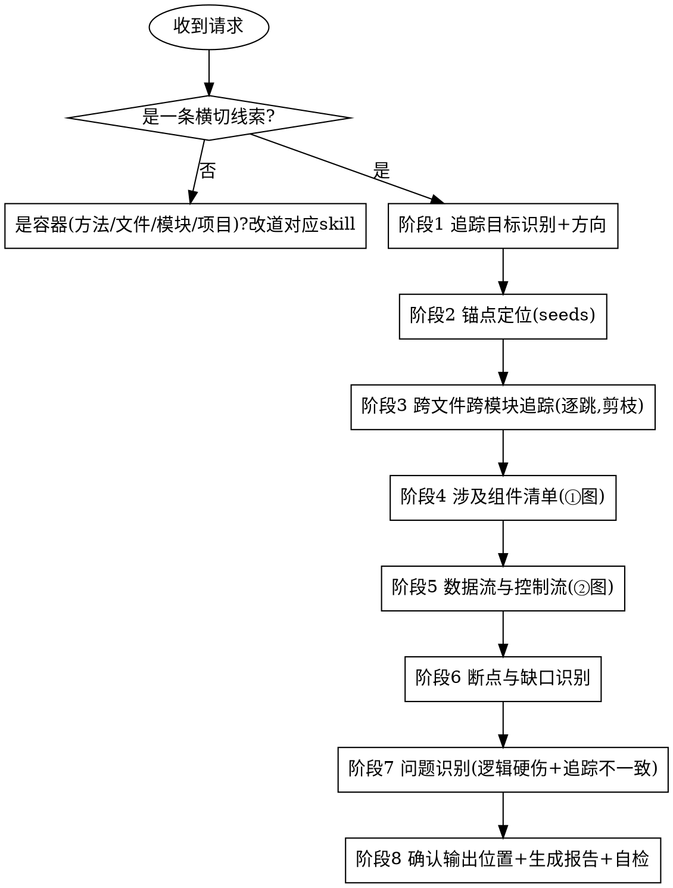

# 深度代码阅读 · 横切追踪 (code-read-deep-trace)

从用户给出的**一条横切线索**（业务能力 / 关注点 / 数据项）出发，**只读不改**地沿数据流与控制流**跨文件、跨模块**把这条线索追踪清楚：
定位锚点（seeds）→ 逐跳追踪 → 汇总涉及组件 → 串出端到端数据/控制流 → 诚实标出断点与缺口 → 顺手记录明显问题，
最后产出一份**结构化、规范化**的中文追踪报告，内含两张 **Mermaid** 图。

报告遵循固定的 8 段结构：**追踪目标 → 起点与终点 → 跨文件跨模块路径 → 涉及组件清单 → 数据流与控制流 → 断点与缺口 → 问题 → 下一步**。

> 与按容器粒度阅读的 `code-read-deep-function/file/module/project` **正交**：它们读"一个容器"，本 skill 追"一条贯穿多个容器的线索"。某一跳要读透时，向对应容器 skill 委派。

---

## 核心定位

- **线索驱动**：分析对象是"一条贯穿系统的线索"（一个 feature / 一个关注点 / 一个数据项），不是某一个方法/文件/模块/项目。
- **跨容器追踪**：核心价值在于把分散在多个文件/模块里的同一条线索**串起来**，并标清每一次"跳"。
- **诚实标断点**：查不下去、漏掉、不一致的地方显式摊开，不假装贯通——这是本 skill 的灵魂。
- **只读不改**；**阅读导向非质量审查**（问题只报逻辑/流程硬伤 + 追踪相关不一致）。
- **多语言**：按各生态的注解/装饰器/中间件/DI/配置识别线索锚点。

---

## 硬性前置：必须是「一条横切线索」

> 先判定，再做其他任何事。

**只接受横切线索作为追踪目标**：业务能力（下单/登录/退款）、关注点（认证/鉴权/缓存/事务/日志/限流/审计）、数据项（某字段/某 ID/某数据的流向）。

以下输入**不走本 skill**（改道对应容器 skill）：

- 只读**单个方法入口 `类名.方法名`** → `code-read-deep-function`。
- 只读**单个文件** → `code-read-deep-file`。
- 只读**单个模块/目录/包** → `code-read-deep-module`。
- 只读**整个项目/仓库的整体结构** → `code-read-deep-project`。
  - 标准回应：
    > 你给的是一个<方法/文件/模块/项目>，想读懂这个容器请用 `code-read-deep-<function/file/module/project>`。
    > 若你想追的是一条**贯穿系统的线索**（如"认证怎么走的""某字段流到哪"），告诉我这条线索是什么，我来跨文件跨模块追。

> 区别要点：容器 skill 答"这个东西内部是什么/怎么组织"；本 skill 答"这条线索跨越哪些东西、怎么流"。

---

## 何时使用 / 何时不用

**使用本 skill：**

- 想知道某个**业务能力/特性**端到端怎么走、经过哪些文件和模块。
- 想知道某个**关注点**（认证/鉴权/缓存/事务/日志/限流）在系统里如何贯穿、在哪些地方生效。
- 想追某个**数据项**（字段/ID/对象）从哪来、流到哪、被谁改。
- 想顺着一条线索把分散的相关代码**串起来**。

**不要用本 skill（改走对应能力）：**

- 单个方法/文件/模块/项目 → 对应的 `code-read-deep-*` 容器 skill。
- 质量/安全/性能审查 → `code-review-deep-zh`；加注释 → `code-annotating`；
- 一句话解释 → `/explain`；调 bug → systematic-debugging；写新功能 → code-vibe-workflow。

---

## 工作流程

按顺序执行，不要跳阶段。详细规则按需加载 `references/trace-rules.md`；

> 必要时加载 `references/reading-lenses.md`——测试即规格 / git 历史 / 运行期证据 / 框架感知（追踪动态分发/DI/中间件时尤其有用）。

各阶段要点见 `references/trace-rules.md`：① 目标识别+方向；② 锚点定位（关键词/入口/数据锚点，多语言）；③ 逐跳跨文件跨模块追踪（剪枝、记录每跳 file:line、动态/框架确认、深挖委派）；④ 涉及组件清单；⑤ 端到端数据/控制流；⑥ 断点与缺口。
**阶段 8**：先由用户指定输出位置/文件名（默认建议 `docs/code-read-deep-trace/<目标>-YYYYMMDD.md`，也可仅对话输出），按 `references/report-template.md` 生成 8 段 + 两图，过自检后交付。

---

## 报告结构（8 段）

完整模板见 `references/report-template.md`：**追踪目标 / 起点与终点 / 跨文件跨模块路径（逐跳带 file:line）/ 涉及组件清单（＋① 涉及组件关系图）/ 数据流与控制流（＋② 端到端追踪流图）/ 断点与缺口 / 问题 / 下一步**。

## 两张 Mermaid 图

- **① 涉及组件关系图**（`flowchart LR`）：线索流经的组件与它们的连接。
- **② 端到端追踪流图**（`flowchart TD`）：起点→…→终点的数据/控制流，断点处标注。

## 规范化自检（交付前必过）

- [ ] 8 段齐全、顺序正确；两张 Mermaid 图存在可渲染。
- [ ] 「跨文件跨模块路径」每一跳都带 `file:line`，可点击可核验。
- [ ] 断点/未走通/未展开均在「断点与缺口」显式声明，未假装贯通。
- [ ] 深读任一容器处都附"向下委派"标注，未在本报告展开某容器内部。
- [ ] 问题分级规范（🔴/🟡/🔵 + 证据 + 影响），仅逻辑硬伤 + 追踪不一致。
- [ ] 聚焦这一条线索，未发散成"读某个容器"或"读整个项目"。
- [ ] 中文表述，术语一致。

---

## 与其他能力的边界

| 能力                                          | 它做什么         | 与本 skill 的区别                                               |
| --------------------------------------------- | ---------------- | --------------------------------------------------------------- |
| `code-read-deep-function/file/module/project` | 读"一个容器"内部 | 本 skill 追"一条贯穿多个容器的线索"，正交；深读某容器委派给它们 |
| `/explain`                                    | 解释一小段代码   | 本 skill 跨文件跨模块串线索、出图                               |
| `code-annotating`                             | 加注释（改文件） | 本 skill 不改码、产报告                                         |
| `code-review-deep-zh`                         | 10 维度质量审查  | 本 skill 是追踪理解、不做全维度审查                             |

## 增量更新与阅读索引（可选）

- **增量更新**：若用户指定的输出位置已存在上一版报告，先读旧报告、对比当前代码变化做**增量更新**（显式标注「新增 / 变化 / 移除」），而非从零重写。
- **阅读索引**：可在 `docs/code-read-deep/INDEX.md` 累积「已读清单」（粒度 ｜ 对象 ｜ 报告路径 ｜ 日期），让重复阅读沉淀为项目知识；首次写入时创建该文件。

---

## 常见错误

- **把线索做成容器**：用户问"认证怎么走"却去逐个读文件 —— 错。要跨容器追这一条线索。
- **假装贯通**：动态分发/配置查不下去还硬接 —— 错。标"断点（原因）"。
- **漏标每一跳的 file:line**：路径不可核验 —— 错。逐跳带位置。
- **越权改码 / 越界报问题 / 自作主张存盘**：同家族 —— 错。
- **容器误吃**：给的是单个方法/文件/模块/项目还硬当线索追 —— 错，改道对应容器 skill。
